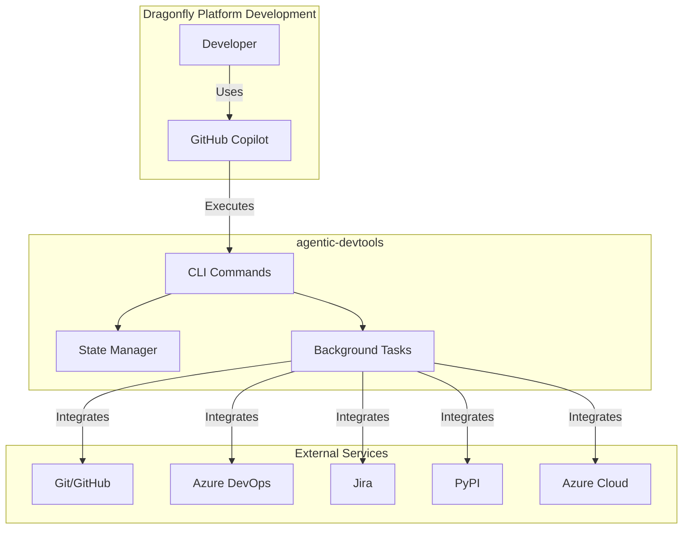

# 1. Introduction and Goals

## 1.1 Requirements Overview

**agentic-devtools** is a Python CLI package designed to enable AI assistants (GitHub Copilot) to perform development workflow operations in the Dragonfly platform ecosystem.

### Primary Goals

1. **Auto-approvable Commands**: Provide CLI commands that can be auto-approved once in VS Code and reused for all operations
2. **AI Assistant Integration**: Enable GitHub Copilot Chat agents to execute complex workflows autonomously
3. **Multi-Service Integration**: Integrate Git, Azure DevOps, Jira, PyPI, and Azure cloud services
4. **State Management**: Maintain workflow state across command invocations via JSON state file
5. **Background Execution**: Run long-running operations asynchronously to avoid blocking AI agents

### Key Features

- Generic `agdt-set/get` commands for state management (approve once, use for any key)
- Parameterless action commands (e.g., `agdt-git-save-work`, `agdt-add-jira-comment`)
- Native handling of special characters and multiline content
- Background task execution with monitoring
- Multi-worktree development support
- Workflow orchestration via Copilot Chat agents

## 1.2 Quality Goals

| Priority | Quality Goal | Motivation |
|----------|-------------|------------|
| 1 | **Usability** | Commands must be intuitive and auto-approvable by VS Code |
| 2 | **Reliability** | State management and API calls must be robust and handle errors gracefully |
| 3 | **Performance** | Long operations must not block AI agents (background tasks) |
| 4 | **Maintainability** | Modular structure enables independent feature development |
| 5 | **Security** | Handle sensitive data (PATs, tokens) securely via environment variables |

## 1.3 Stakeholders

| Role | Expectations | Concerns |
|------|-------------|----------|
| **AI Assistants** | Simple, auto-approvable commands with clear output | Command approval UX, output parsing, error handling |
| **Developers** | Automated workflow execution, reduced manual steps | Reliability, debugging, state inspection |
| **DevOps Engineers** | CI/CD integration, release automation | Deployment, versioning, monitoring |
| **Platform Team** | Azure DevOps/Jira integration consistency | API compatibility, rate limiting, authentication |

## 1.4 Business Context

## 1.5 Use Cases

### UC1: Work on Jira Issue

**Actor**: AI Assistant (Copilot)

**Flow**:

1. Retrieve Jira issue details
2. Create worktree and branch
3. Post implementation plan to Jira
4. Generate implementation checklist
5. Execute implementation
6. Run tests and quality checks
7. Commit changes
8. Create pull request
9. Post completion comment to Jira

### UC2: Review Pull Request

**Actor**: AI Assistant (Copilot)

**Flow**:

1. Fetch PR details and diff
2. Review each file
3. Post file-level comments
4. Generate summary review
5. Approve or request changes

### UC3: Publish Release

**Actor**: Developer/CI Pipeline

**Flow**:

1. Create Git tag
2. Build Python package
3. Validate distribution
4. Upload to PyPI

## 1.6 Success Criteria

- ✅ All commands require one-time approval in VS Code
- ✅ AI assistants can complete full workflows autonomously
- ✅ Background tasks run without blocking AI agents
- ✅ State persists across command invocations
- ✅ 95%+ test coverage
- ✅ Zero secrets in source code
- ✅ Clear error messages and actionable output
