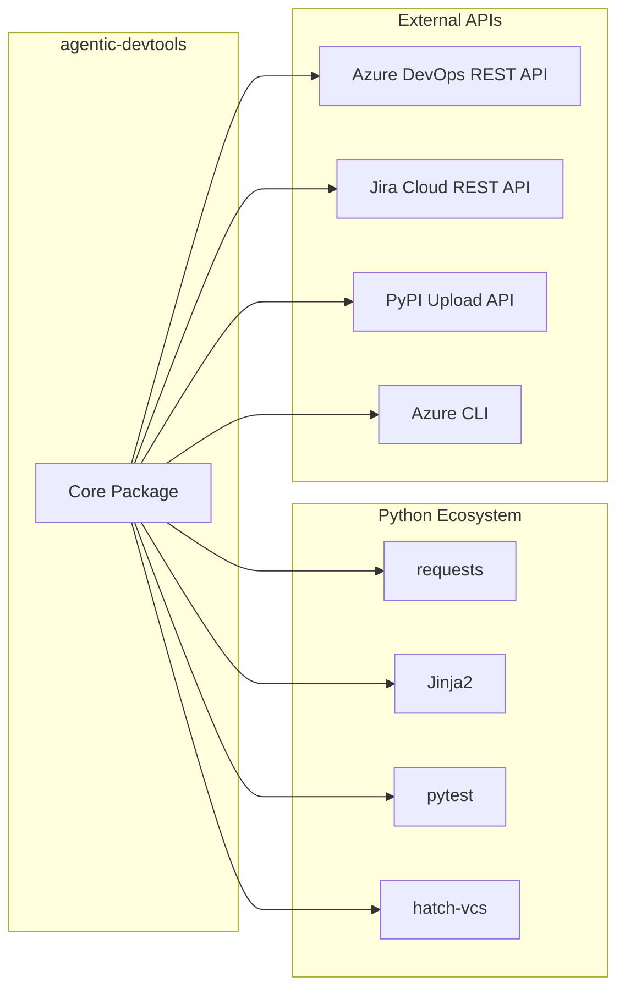

# 2. Architecture Constraints

## 2.1 Technical Constraints

| Constraint | Background and Motivation |
|-----------|---------------------------|
| **Python 3.8+** | Target modern Python with type hints, dataclasses, and async/await support |
| **pip-installable** | Standard Python packaging via PyPI for easy installation |
| **CLI interface** | Commands must be executable from shell/terminal for VS Code integration |
| **JSON state file** | Lightweight, human-readable state persistence without database dependencies |
| **Cross-platform** | Support Windows, macOS, Linux (Dragonfly team uses all three) |
| **No GUI** | Terminal-only interface for automation and CI/CD compatibility |

## 2.2 Organizational Constraints

| Constraint | Background and Motivation |
|-----------|---------------------------|
| **VS Code Copilot Integration** | All commands must work with GitHub Copilot Chat approval workflow |
| **One-time Approval** | Generic commands (`agdt-set`) enable approve-once-use-everywhere pattern |
| **Azure DevOps First** | Primary VCS/project management is Azure DevOps (not GitHub) |
| **Jira Integration** | Issue tracking via Jira Cloud requires API compatibility |
| **Test-driven Development** | High test coverage (95%+) required for reliability |

## 2.3 Conventions

| Convention | Background and Motivation |
|-----------|---------------------------|
| **Command Naming** | All commands prefixed with `agdt-` for namespace isolation |
| **State Keys** | Namespaced keys (e.g., `jira.issue_key`, `file_review.file_path`) |
| **Background Tasks** | Long operations (>5s) must run as background tasks |
| **Parameterless Commands** | Action commands read from state (no CLI parameters for approval) |
| **Output Files** | Query results written to `scripts/temp/` for persistence |

## 2.4 Development Constraints

| Constraint | Background and Motivation |
|-----------|---------------------------|
| **pyproject.toml** | Modern Python packaging with PEP 517/518 |
| **hatch-vcs** | Dynamic versioning from Git tags |
| **pytest** | Standard test framework with coverage reporting |
| **markdownlint** | All markdown must pass linting rules |
| **GitHub Actions** | CI/CD via GitHub workflows (test, lint, publish) |

## 2.5 External Dependencies

## 2.6 Security Constraints

| Constraint | Background and Motivation |
|-----------|---------------------------|
| **No Secrets in Code** | All credentials via environment variables |
| **PAT Authentication** | Azure DevOps and Jira use Personal Access Tokens |
| **State File Location** | `scripts/temp/agdt-state.json` excluded from Git |
| **File Locking** | Concurrent access protection via cross-platform locking |
| **No Cloud Storage** | State remains local to avoid data leakage |

## 2.7 VS Code Integration Constraints

| Constraint | Impact |
|-----------|--------|
| **Command Approval** | Each unique command requires approval before first use |
| **Parameterless Design** | Parameters via state file to minimize approval prompts |
| **Output Format** | Clear, actionable messages for AI parsing |
| **Exit Codes** | Standard exit codes (0=success, non-zero=error) |
| **Background Tasks** | Immediate return with task ID for status checking |

## 2.8 Multi-Worktree Constraints

| Constraint | Background and Motivation |
|-----------|---------------------------|
| **Same Command Interface** | No command changes required for worktree usage |
