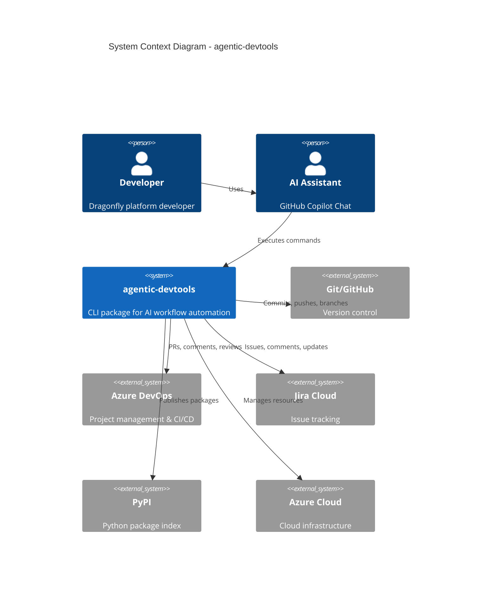
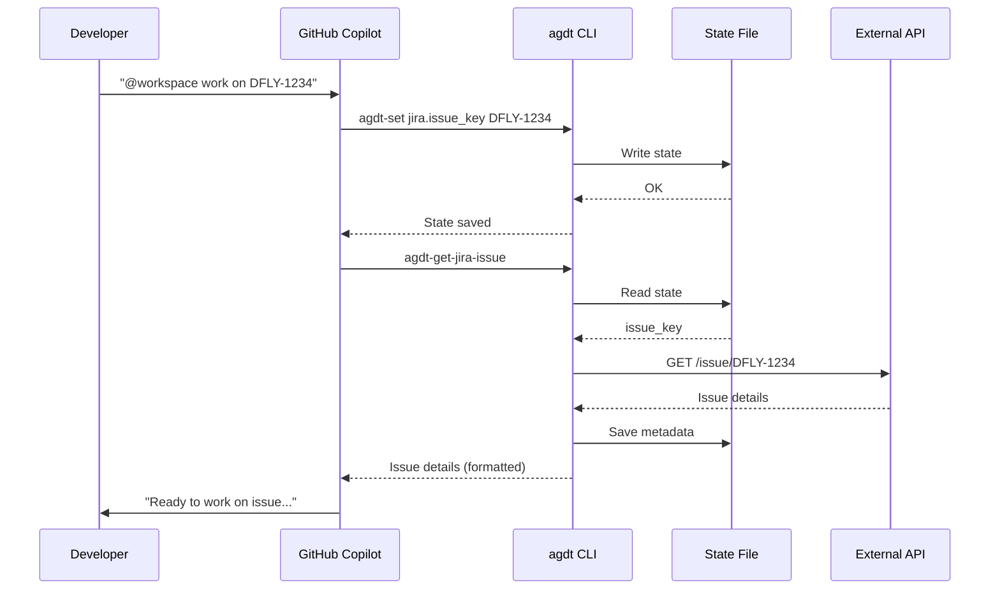
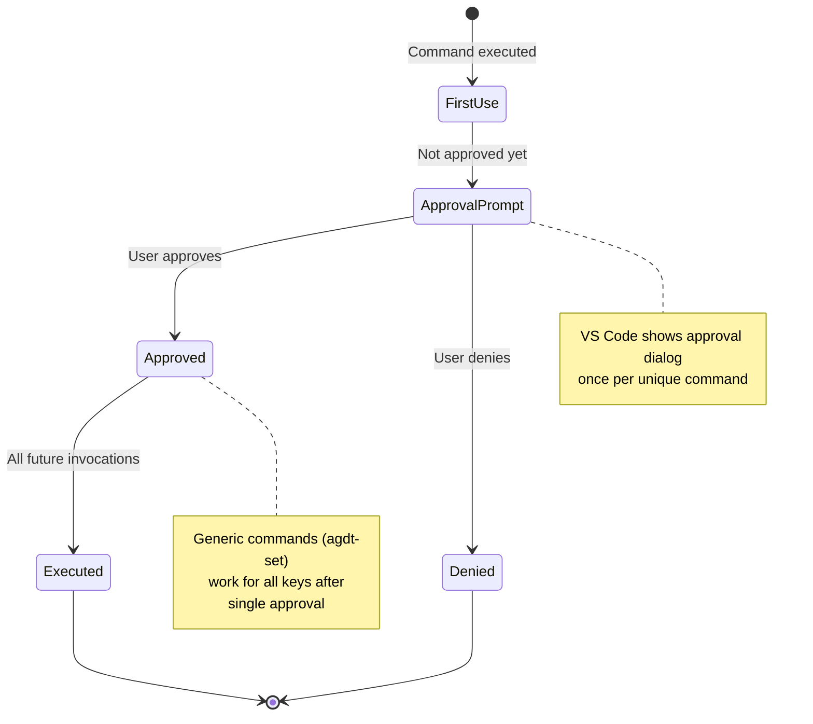
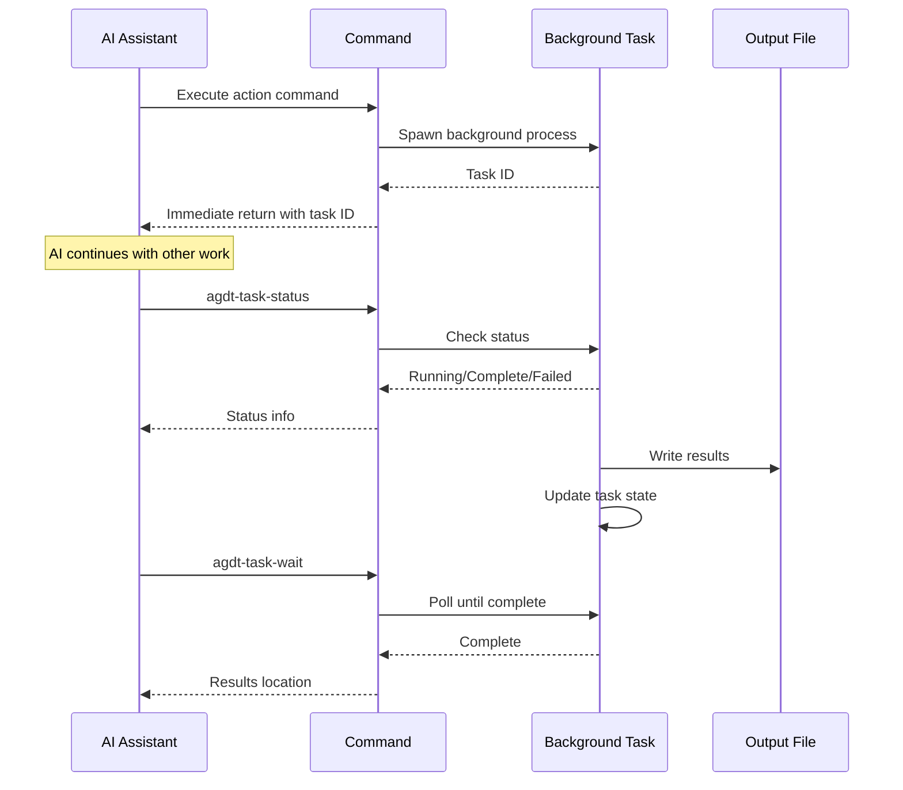
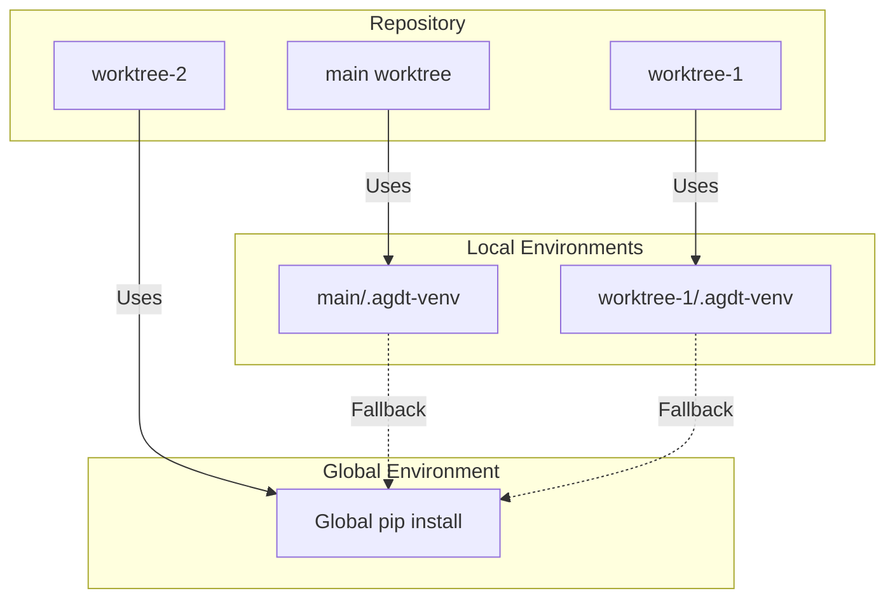

# 3. System Context

## 3.1 Business Context

**agentic-devtools** acts as a bridge between AI assistants (GitHub Copilot) and external development services, enabling automated workflow execution in the Dragonfly platform development process.

## 3.2 External Interfaces

### 3.2.1 Git/GitHub

**Purpose**: Version control and repository management

**Interface**:

- Local Git commands (`git commit`, `git push`, `git worktree`)
- GitHub API for repository operations

**Data Flow**:

- **Outbound**: Commits, branches, tags
- **Inbound**: Branch status, commit history

### 3.2.2 Azure DevOps

**Purpose**: Pull requests, code reviews, CI/CD pipelines

**Interface**:

- Azure DevOps REST API v7.0
- Authentication via Personal Access Token (PAT)
- Endpoints: PRs, threads, comments, pipelines, work items

**Data Flow**:

- **Outbound**: PR comments, review approvals, thread replies, pipeline triggers
- **Inbound**: PR details, diffs, threads, pipeline status

### 3.2.3 Jira Cloud

**Purpose**: Issue tracking and project management

**Interface**:

- Jira REST API (Cloud, primarily v2 endpoints)
- Authentication via API token (bearer or basic with email/username)
- Endpoints: Issues, comments, transitions, custom fields

**Data Flow**:

- **Outbound**: Comments, status updates, field modifications
- **Inbound**: Issue details, metadata, subtasks, epics

### 3.2.4 PyPI

**Purpose**: Python package distribution

**Interface**:

- PyPI upload API (via Twine)
- Authentication via API token

**Data Flow**:

- **Outbound**: Package distributions (wheel, sdist)
- **Inbound**: Upload status, version existence checks

### 3.2.5 Azure Cloud

**Purpose**: Azure resource management (optional)

**Interface**:

- Azure CLI (`az` command)
- Azure REST APIs

**Data Flow**:

- **Outbound**: Resource configurations, deployments
- **Inbound**: Resource status, logs

## 3.3 User Interaction Model

## 3.4 Command Approval Flow

## 3.5 Background Task Execution Model

## 3.6 Multi-Worktree Model

