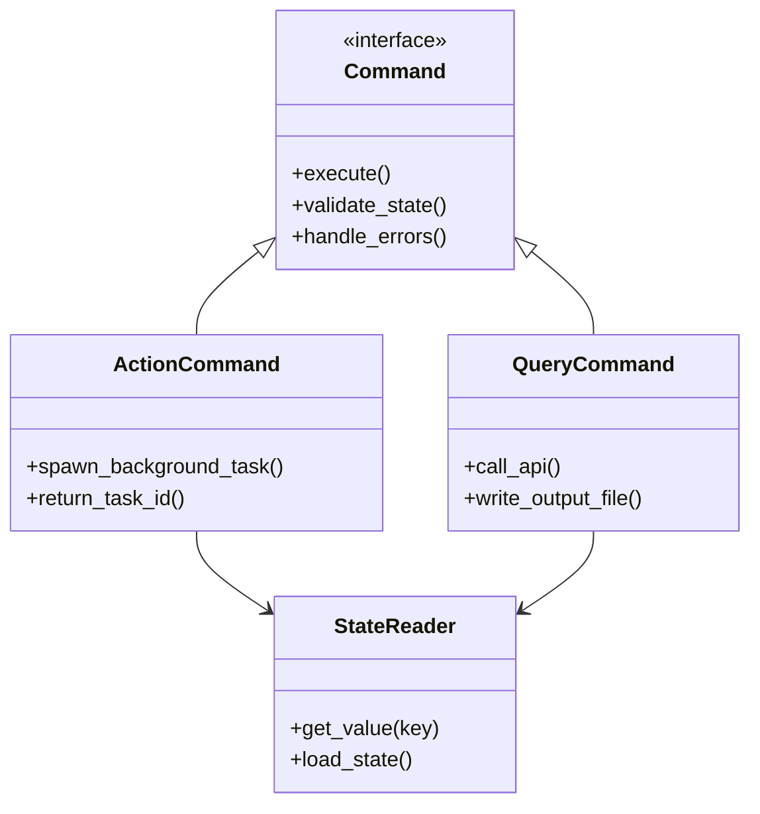
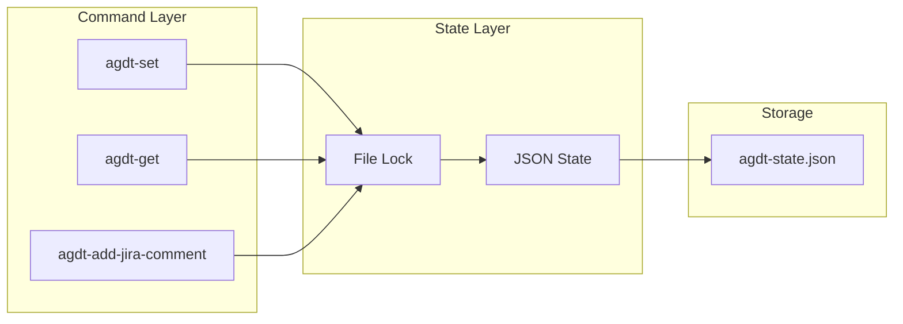
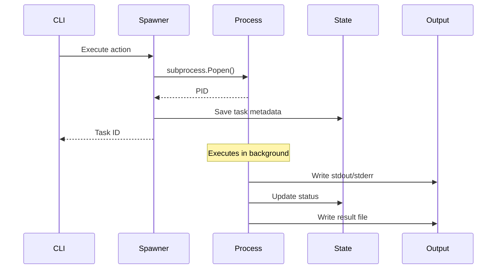
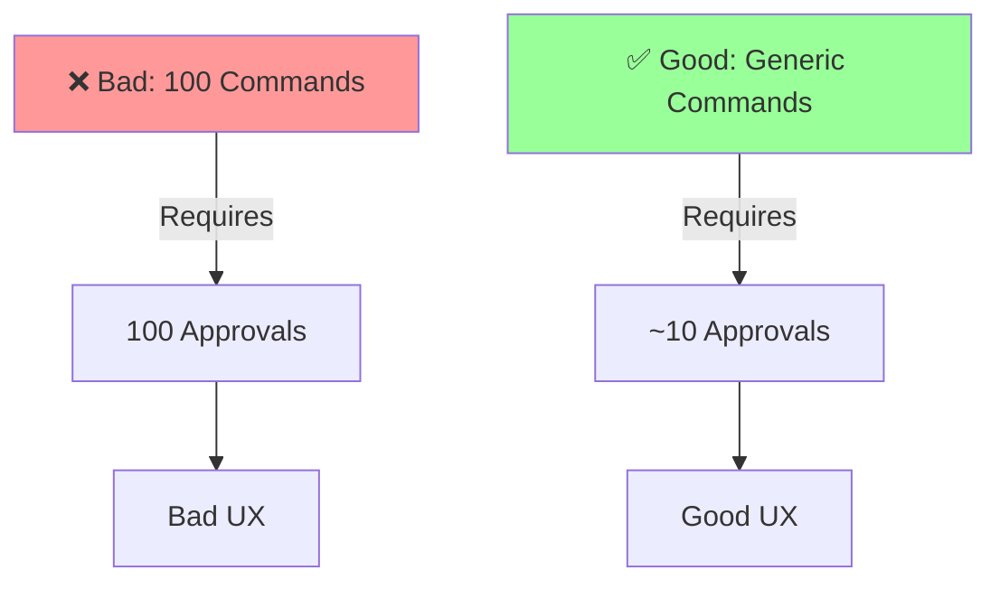
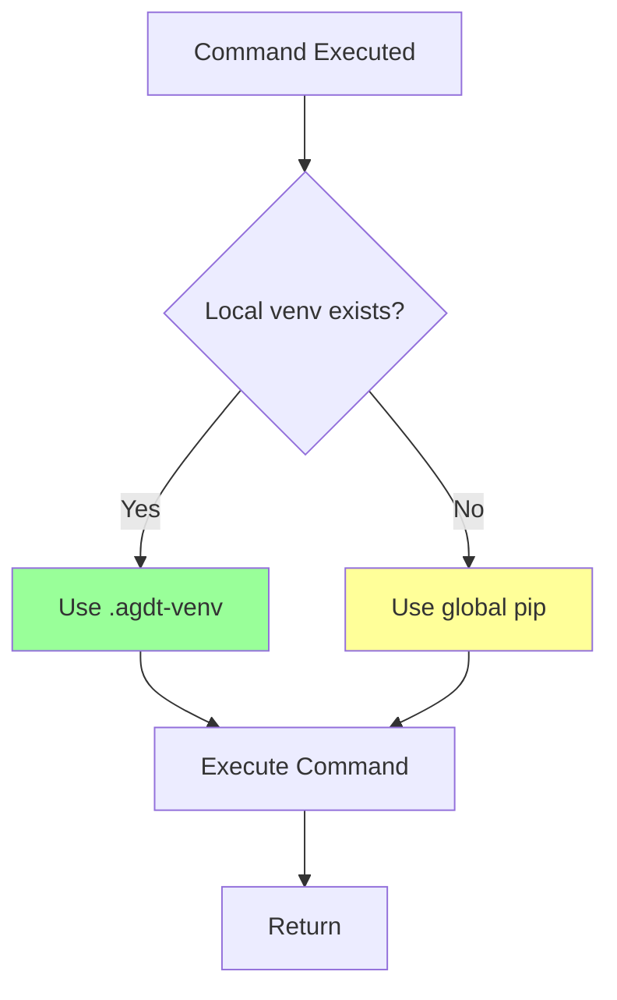
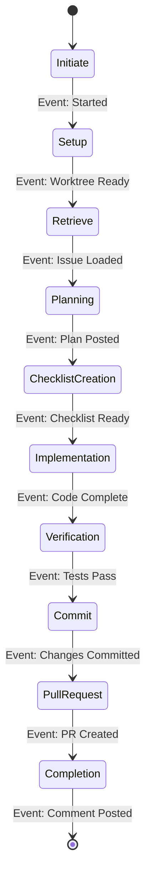
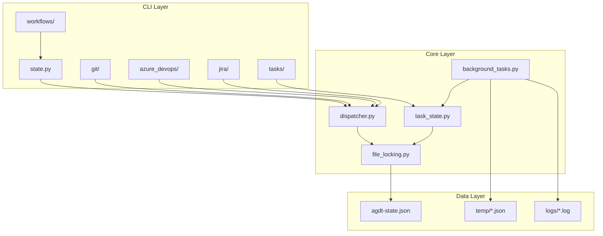
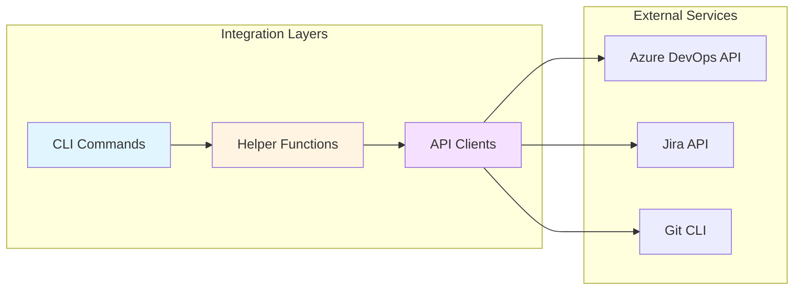

# 4. Solution Strategy

## 4.1 Technology Decisions

| Decision | Rationale | Alternatives Considered |
|----------|-----------|------------------------|
| **Python** | Native CLI support, rich ecosystem, type hints, async/await | Node.js (complex approval), Bash (limited) |
| **argparse** | Standard library, no extra dependency, explicit flags | Click (extra dependency), Typer (overkill) |
| **JSON State File** | Simple, human-readable, no database | SQLite (overkill), YAML (parsing issues) |
| **Background Tasks** | Non-blocking AI agents, subprocess isolation | Threading (complex), Celery (heavyweight) |
| **Mermaid** | GitHub native, VS Code support, simple syntax | PlantUML (external), Graphviz (complex) |

## 4.2 Design Patterns

### 4.2.1 Command Pattern

All CLI commands follow a consistent pattern:

### 4.2.2 State Management Pattern

Centralized state with namespaced keys:

### 4.2.3 Background Task Pattern

Asynchronous execution with status tracking:

## 4.3 Key Architectural Approaches

### 4.3.1 Auto-Approval Strategy

**Problem**: VS Code requires approval for each unique command

**Solution**: Generic commands with state-based parameters

**Examples**:

- ❌ `agdt-add-pr-comment --pr-id 123 --message "..."` (unique per PR)
- ✅ `agdt-set pr_id 123` + `agdt-set content "..."` + `agdt-add-pr-comment` (reusable)

### 4.3.2 Multi-Worktree Strategy

**Problem**: Different branches may need different package versions

**Solution**: Auto-detect repo-local virtual environment

### 4.3.3 Workflow Orchestration Strategy

**Problem**: Complex multi-step workflows are hard to manage

**Solution**: Step-based workflows with state transitions

## 4.4 Module Organization

## 4.5 Quality Strategies

| Quality Goal | Strategy | Implementation |
|--------------|----------|----------------|
| **Usability** | Consistent command patterns | All commands follow same structure |
| **Reliability** | Comprehensive testing | 95%+ coverage, integration tests |
| **Performance** | Background execution | Long operations don't block |
| **Maintainability** | Modular packages | Each service in separate package |
| **Security** | Environment variables | No secrets in code or state |

## 4.6 Integration Strategy

## 4.7 Deployment Strategy

- **Distribution**: PyPI package (`pip install agentic-devtools`)
- **Installation**: Global via pip/pipx, or local via `.agdt-venv`
- **Configuration**: Environment variables for credentials
- **Updates**: Version from Git tags via hatch-vcs
- **CI/CD**: GitHub Actions for test, lint, publish
