# 5. Building Blocks View

## 5.1 Level 1: System Overview

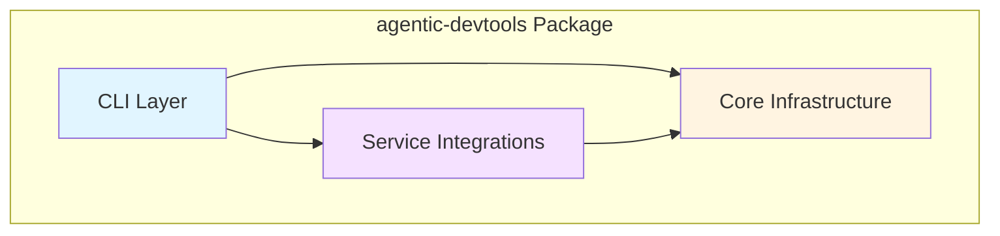

## 5.2 Level 2: Package Structure

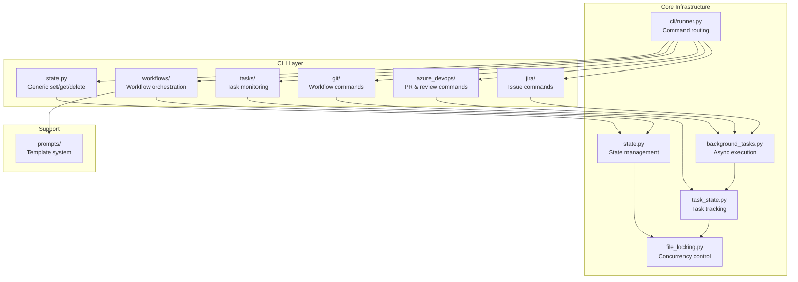

Note: `Runner` here refers to `cli/runner.py`, which provides programmatic access to all commands by name.
Console script entry points call `cli.runner:run_as_script`, which uses `COMMAND_MAP` to route to the
appropriate CLI implementation function and centralizes routing and `KeyboardInterrupt` handling.

## 5.3 Level 3: Core Components

### 5.3.1 State Management

**Note**: The diagrams below show conceptual class representations for clarity. The actual implementation uses module-level functions rather than class-based APIs.

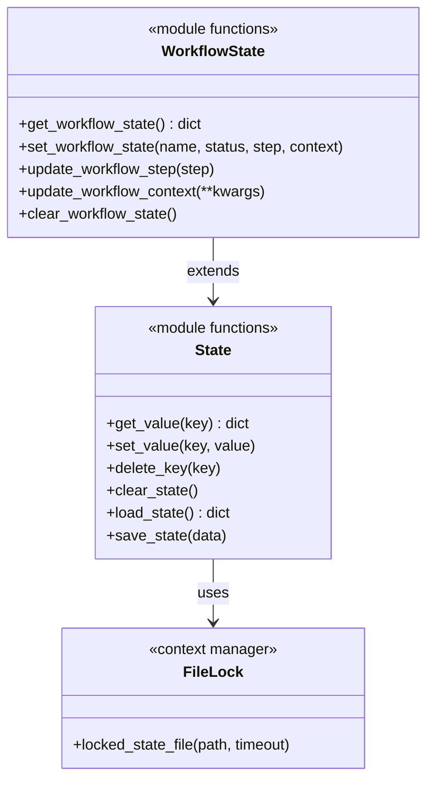

**Responsibilities**:

- Persistent key-value storage
- Namespace management (e.g., `jira.`, `file_review.`)
- Concurrent access protection
- Workflow state tracking

### 5.3.2 Background Tasks

**Note**: The diagram below shows conceptual relationships. `BackgroundTask` is a dataclass in `task_state.py`, while spawning/monitoring is handled by module-level functions in `background_tasks.py`.

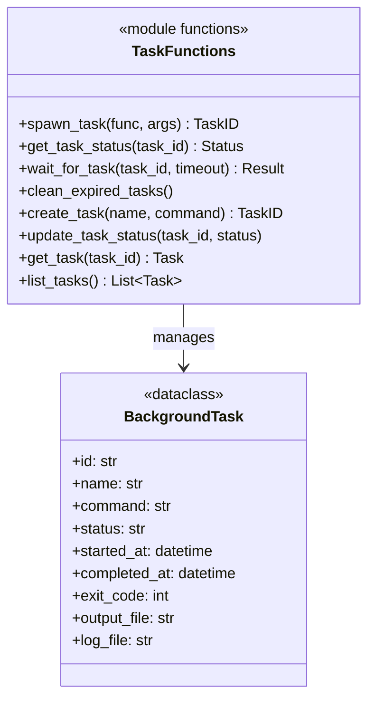

**Responsibilities**:

- Spawn subprocess for long operations
- Track task status and metadata
- Capture stdout/stderr to log files
- Write results to output files
- Clean up expired tasks

### 5.3.3 Command Runner

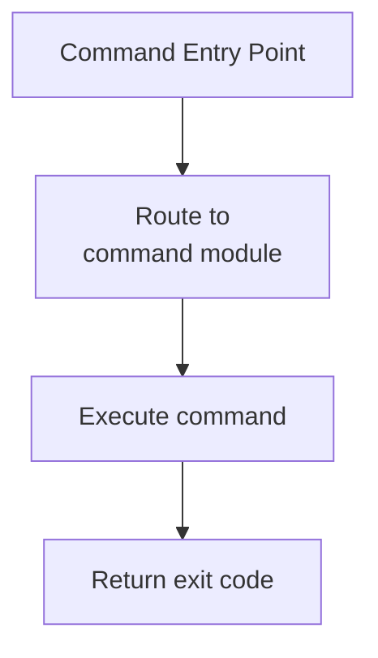

**Responsibilities**:

- Map command names to implementation modules
- Import and invoke the appropriate command handler

## 5.4 Service Integration Modules

### 5.4.1 Azure DevOps Module

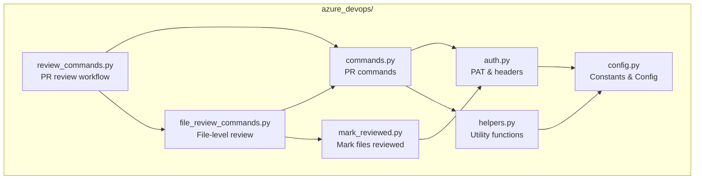

**Responsibilities**:

- Authenticate with Azure DevOps PAT
- Create/update pull requests
- Add PR comments and thread replies
- Manage PR review workflow
- Mark files as reviewed
- Trigger pipelines

### 5.4.2 Jira Module

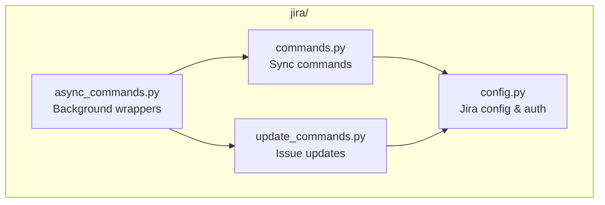

**Responsibilities**:

- Authenticate with Jira API token
- Fetch issue details
- Add comments to issues
- Update issue fields
- Create issues, epics, subtasks
- Manage project roles

### 5.4.3 Git Module

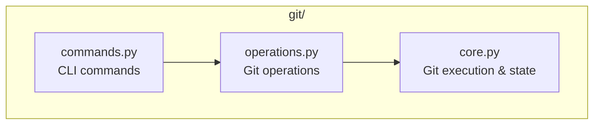

**Responsibilities**:

- Execute git commands
- Stage, commit, push changes
- Manage branches and worktrees
- Smart commit/amend detection
- Checklist integration

## 5.5 Workflow System

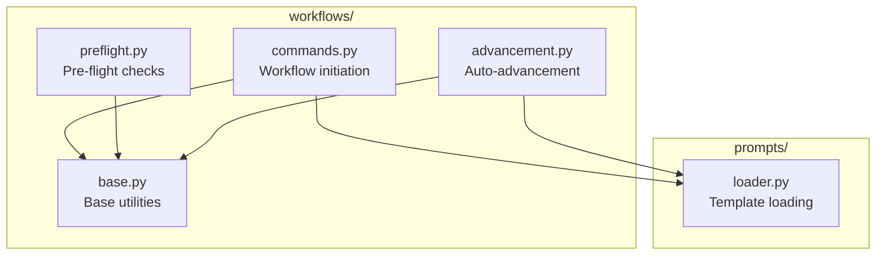

**Workflow Types**:

1. **work-on-jira-issue**: 11-step workflow from issue to PR
2. **pull-request-review**: 5-step PR review workflow
3. **apply-pr-suggestions**: Apply review feedback
4. **create-jira-issue/epic/subtask**: Jira item creation

**Workflow State Machine**:

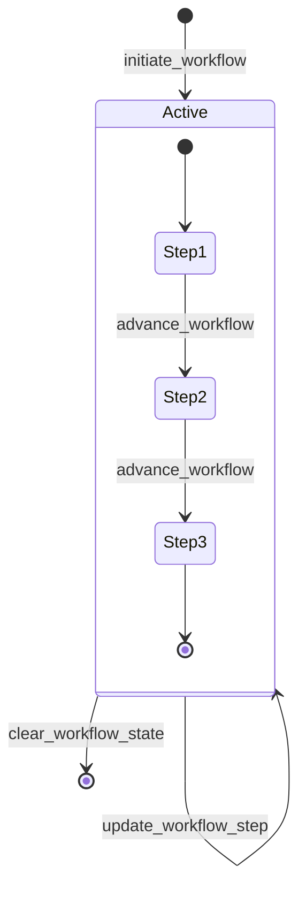

## 5.6 Data Flow

### 5.6.1 Command Execution Flow

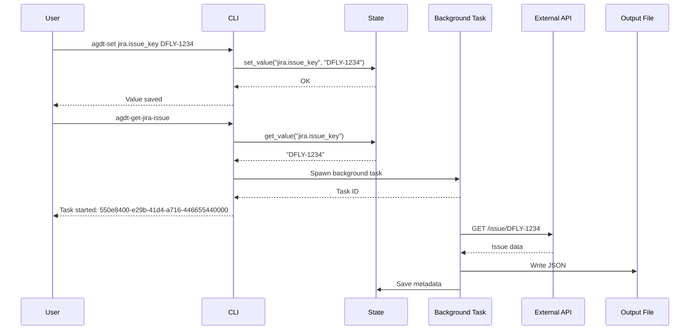

### 5.6.2 Workflow Execution Flow

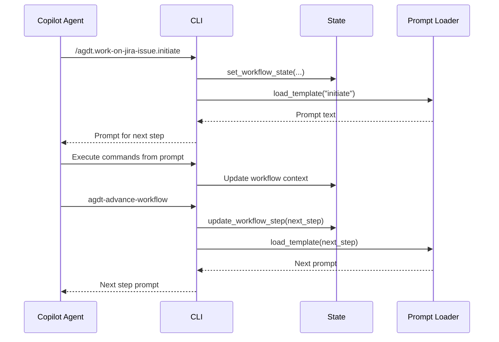

## 5.7 Key Interfaces

| Component | Public Interface | Consumers |
|-----------|-----------------|-----------|
| **state.py** | `get_value`, `set_value`, `delete_key`, `clear_state` | All CLI commands |
| **background_tasks.py** | `spawn_task`, `get_task_status`, `wait_for_task` | Action commands |
| **task_state.py** | `create_task`, `update_task_status`, `get_task`, `list_tasks` | Background tasks |
| **cli/runner.py** | Command routing | Entry points, programmatic use |
| **prompts/loader.py** | `load_template`, `substitute_variables`, `save_output` | Workflow commands |
