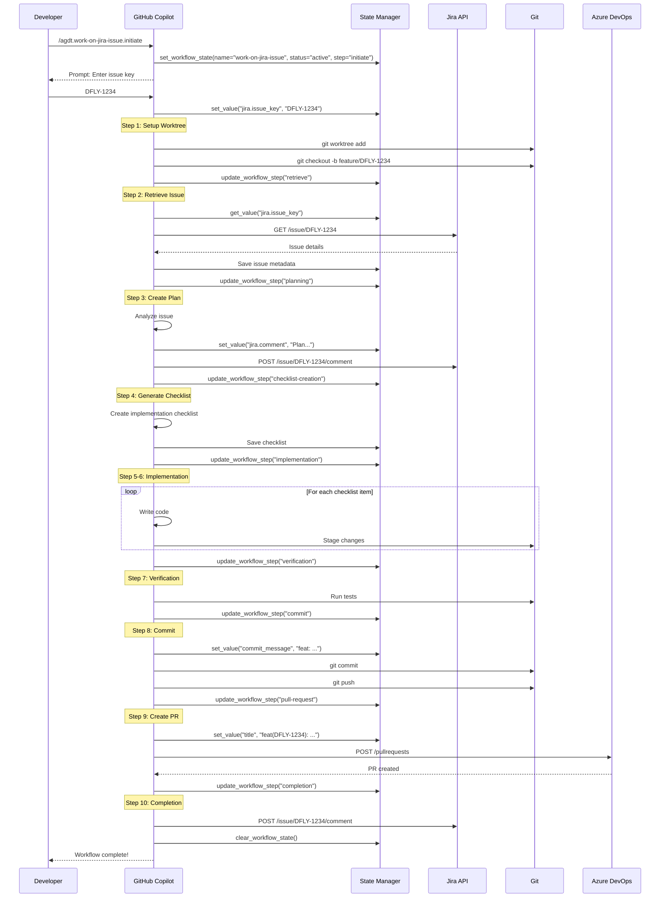
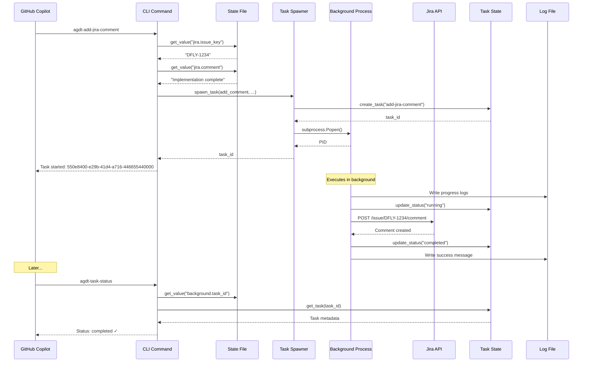
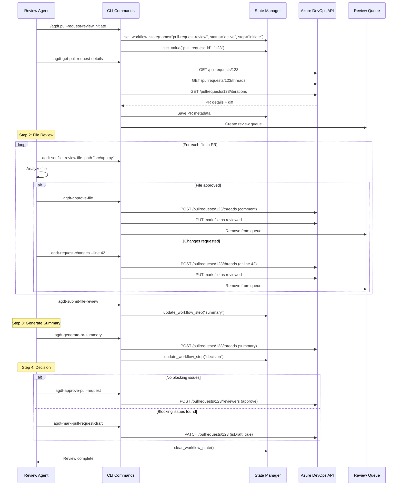
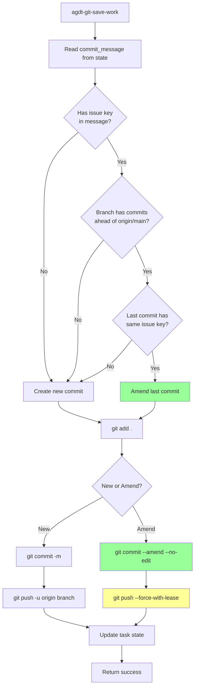
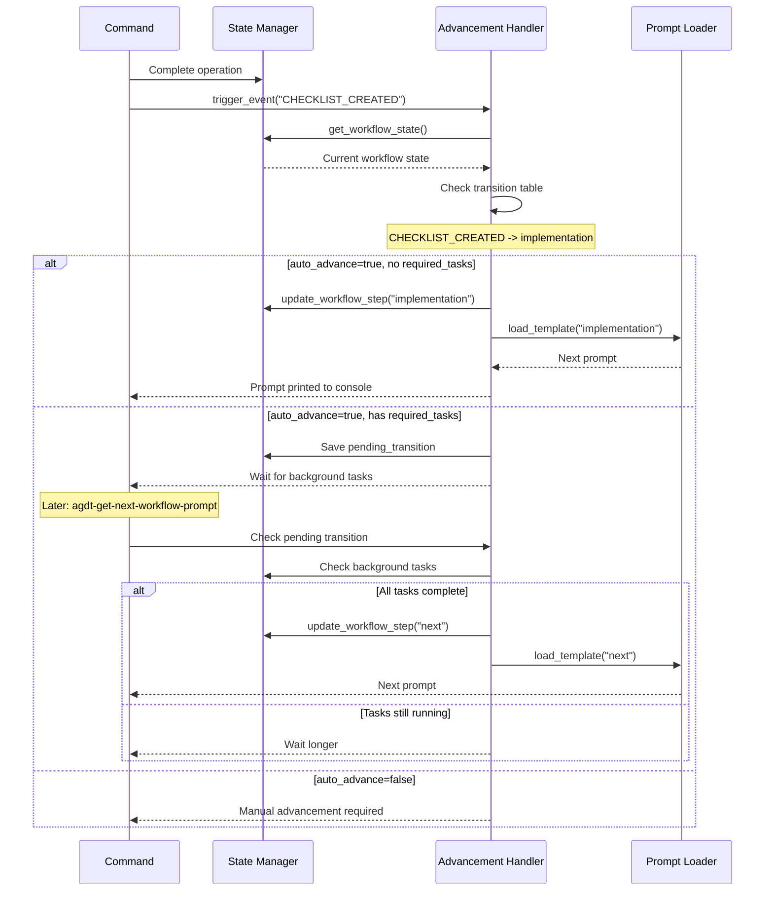
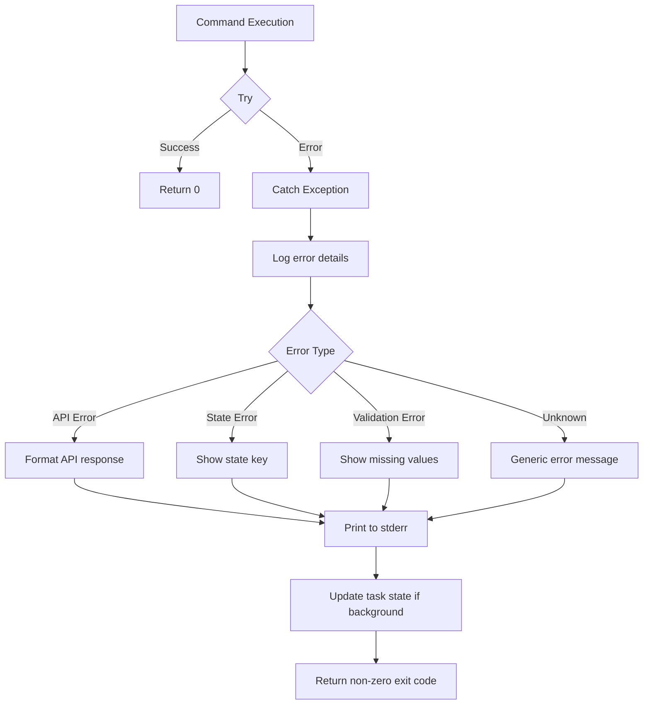
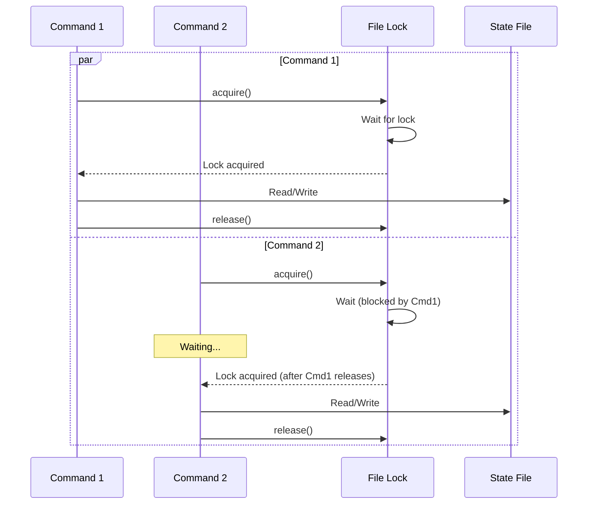

# 6. Runtime View

## 6.1 Scenario: Work on Jira Issue (Complete Workflow)

This scenario demonstrates the full workflow from issue retrieval to PR creation.

## 6.2 Scenario: Add Jira Comment (Background Task)

## 6.3 Scenario: Pull Request Review

## 6.4 Scenario: Smart Git Commit (Amend Detection)

## 6.5 Scenario: Workflow Auto-Advancement

## 6.6 Error Handling Patterns

## 6.7 State Locking During Concurrent Access

