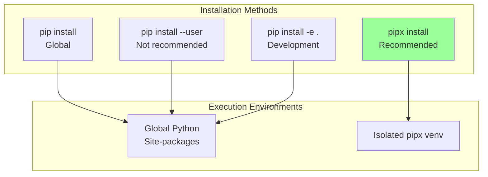
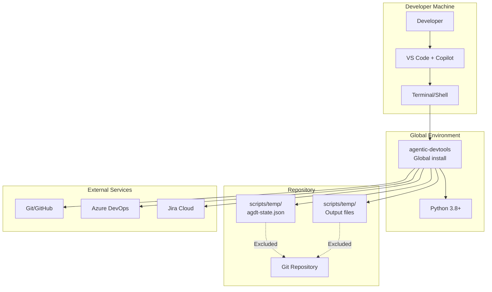
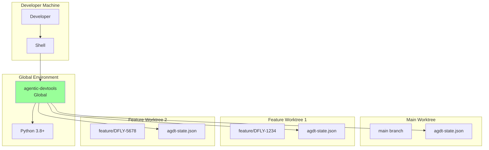
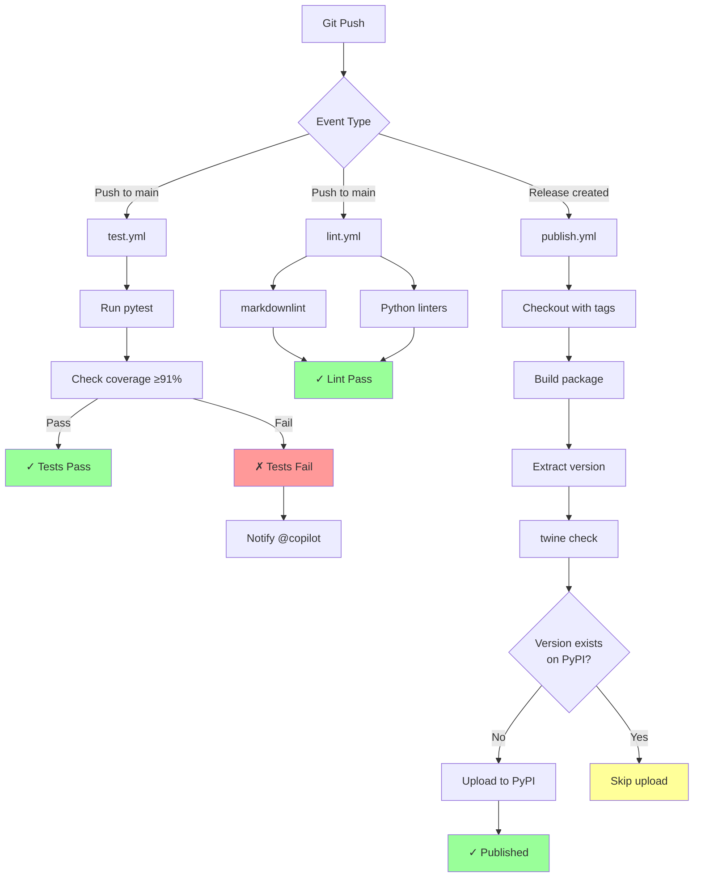
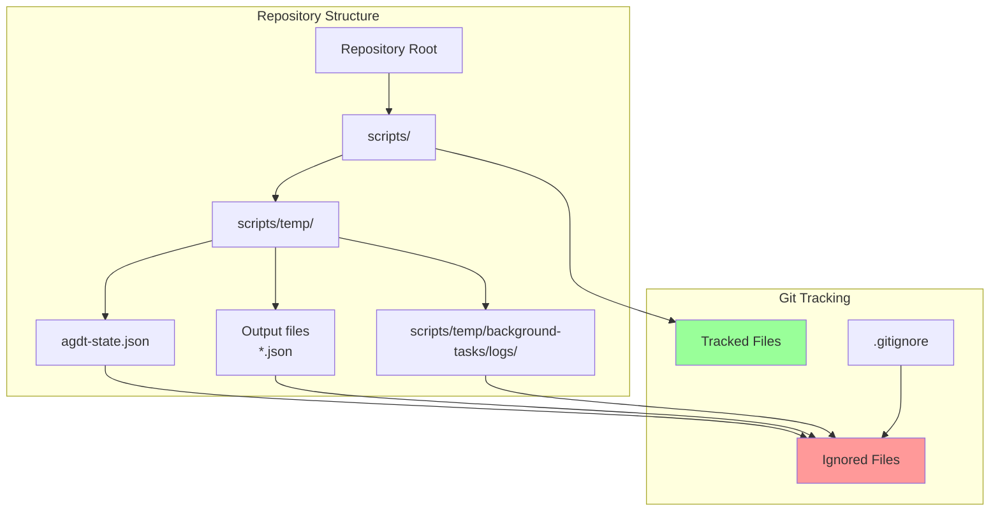
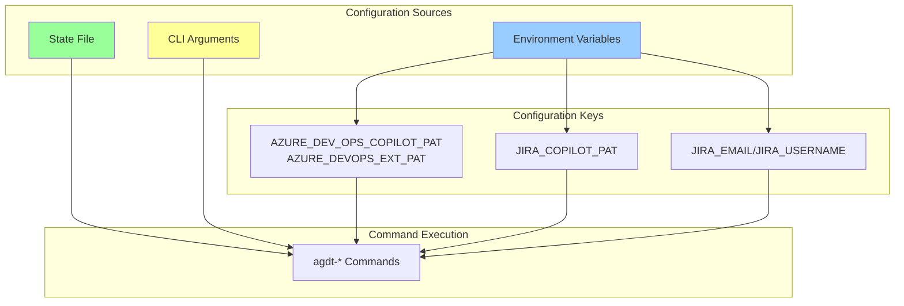
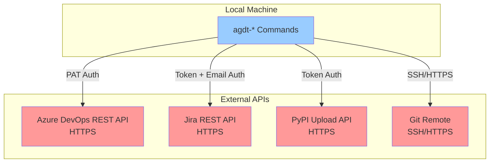
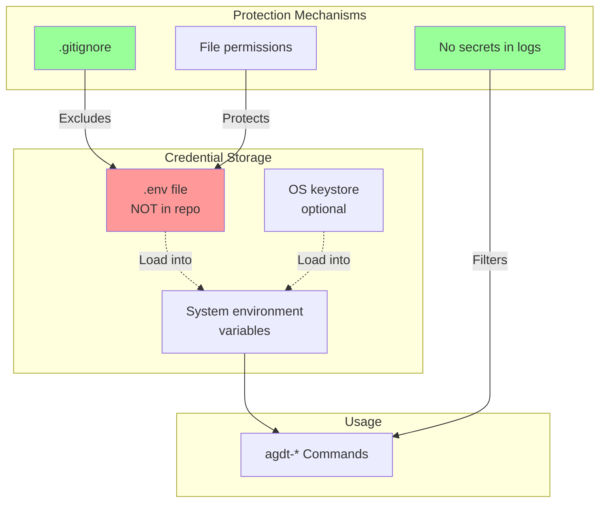
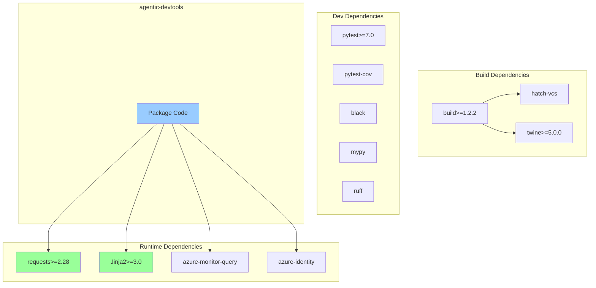

# 7. Deployment View

## 7.1 Installation Options



## 7.2 Runtime Environment

### 7.2.1 Single Worktree Deployment



### 7.2.2 Multi-Worktree Deployment



## 7.3 CI/CD Deployment

```mermaid
graph TB
    subgraph "Developer"
        Dev[Developer]
        LocalGit[Local Git]
    end
    
    subgraph "GitHub"
        Repo[GitHub Repository]
        Actions[GitHub Actions]
    end
    
    subgraph "Workflows"
        Test[Test Workflow]
        Lint[Lint Workflow]
        Publish[Publish Workflow]
        Release[Release Workflow]
    end
    
    subgraph "PyPI"
        PyPI[PyPI Package Index]
    end
    
    Dev -->|Push| LocalGit
    LocalGit -->|Push| Repo
    Repo -->|Trigger| Actions
    Actions --> Test
    Actions --> Lint
    Actions --> Publish
    Actions --> Release
    
    Publish -->|Upload| PyPI
    
    Test -.->|Block if fail| Publish
    Lint -.->|Block if fail| Publish
```

## 7.4 GitHub Actions Workflow Deployment



## 7.5 State File Deployment



**State File Locations**:

- Default: `scripts/temp/agdt-state.json`
- Excluded from Git via `.gitignore`
- One state file per worktree
- Background task logs in `scripts/temp/background-tasks/logs/`
- Output files in `scripts/temp/`

## 7.6 Configuration Deployment



## 7.7 Network Communication



**Network Requirements**:

- Internet connectivity for external APIs
- HTTPS/TLS for all API communication
- SSH or HTTPS for Git operations
- Proxy support via standard environment variables

## 7.8 Security Deployment



**Security Best Practices**:

1. **Credentials**: Store in environment variables only
2. **State File**: Excluded from Git, contains no secrets
3. **Logs**: Sanitize sensitive data before writing
4. **Output Files**: Excluded from Git, may contain temporary data
5. **File Permissions**: Restrict access to state and temp directories

## 7.9 Package Dependencies


