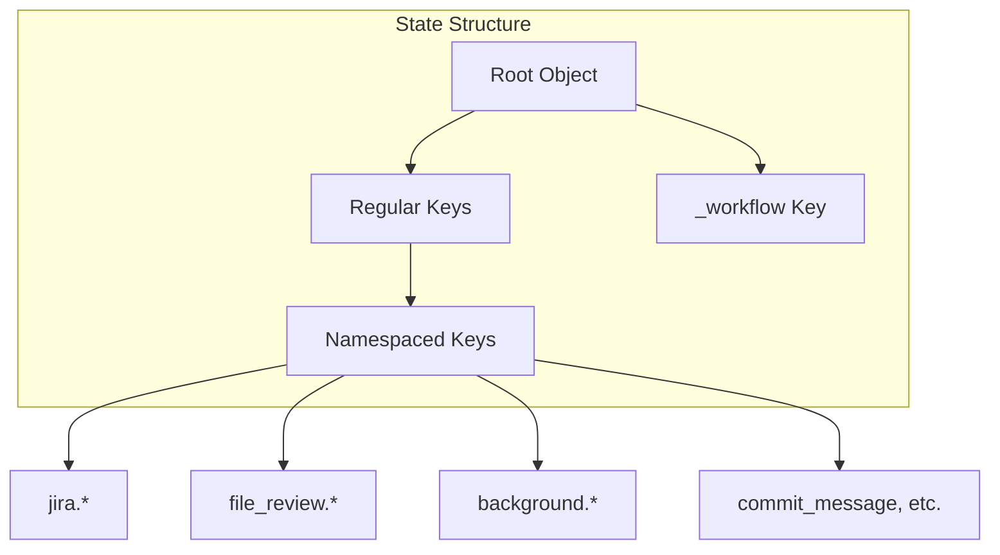
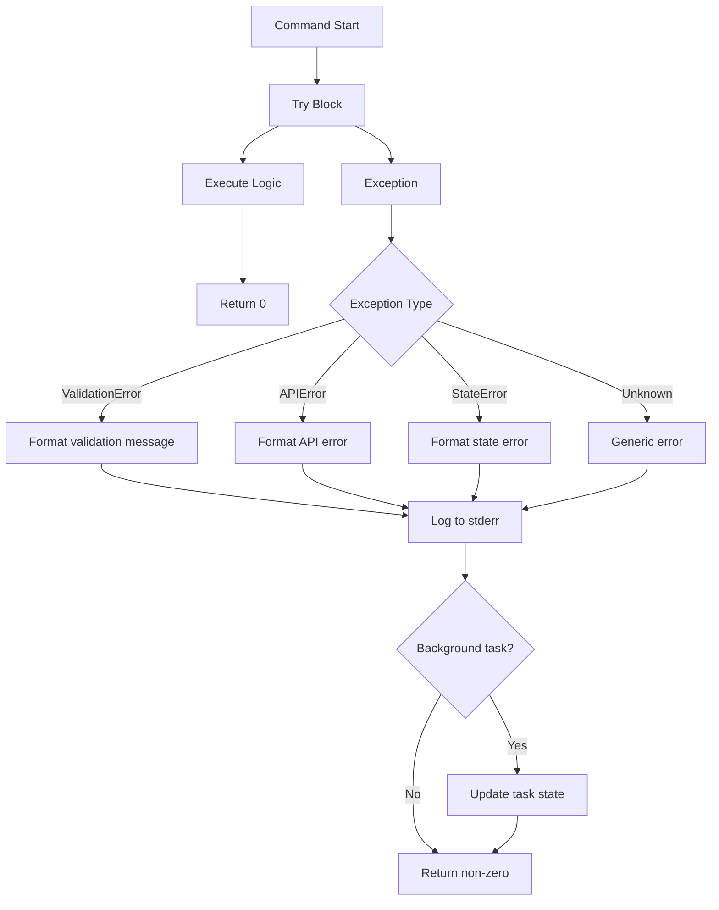
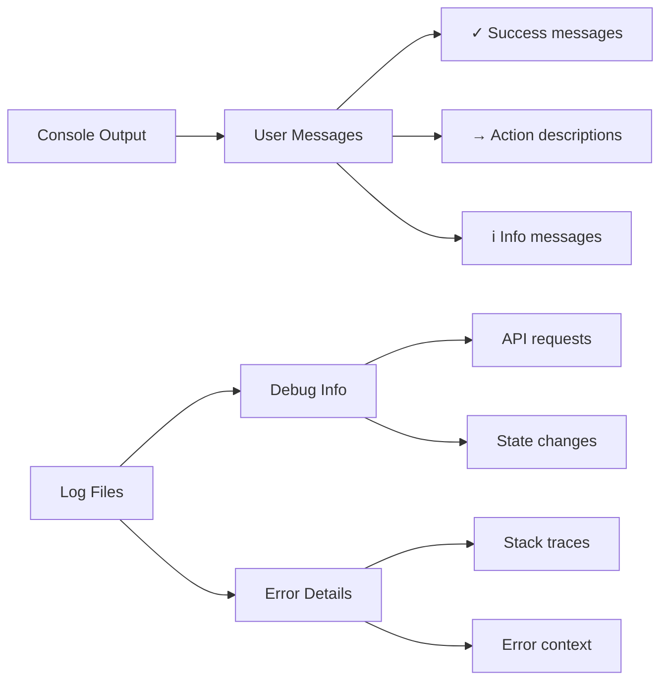
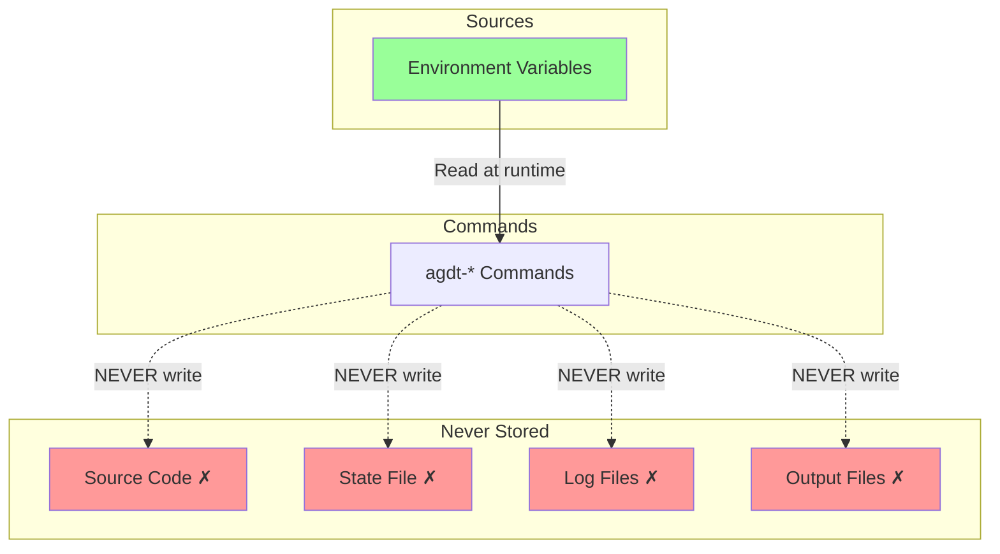
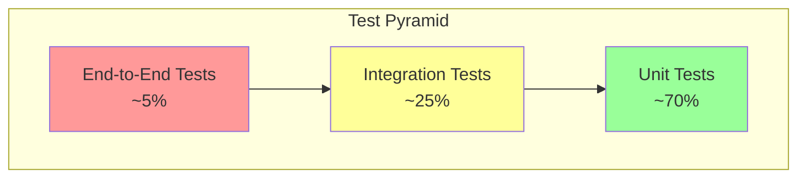
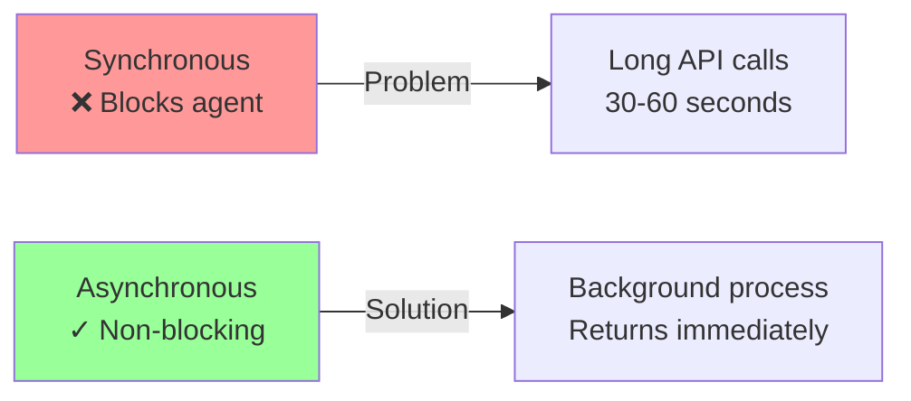
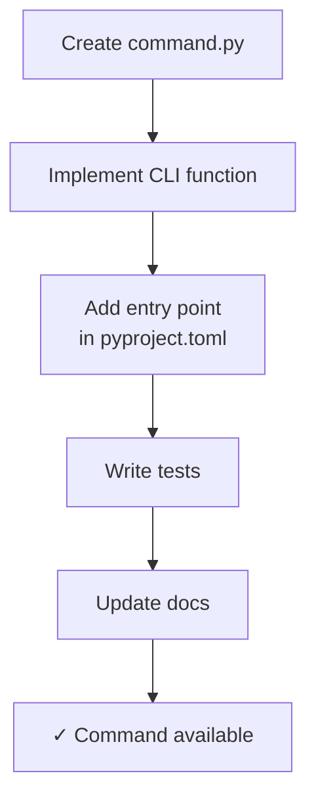
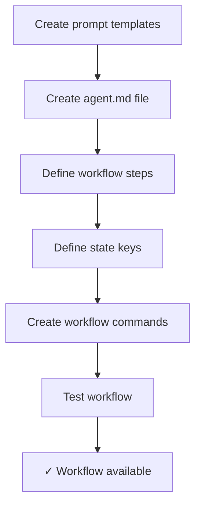
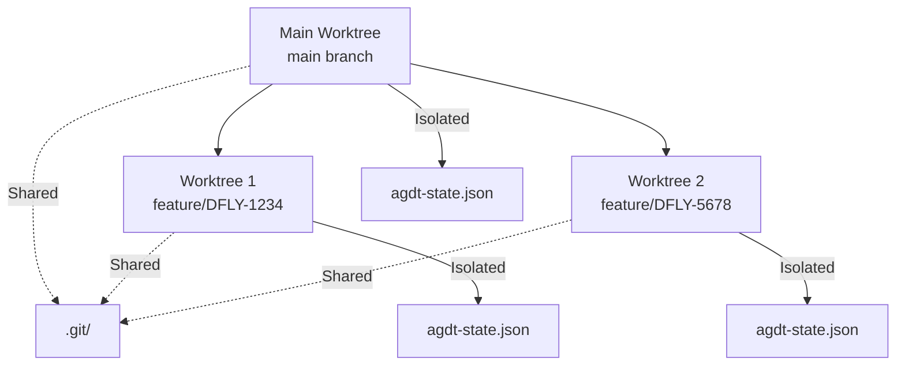

# 8. Cross-cutting Concepts

## 8.1 State Management

### 8.1.1 Centralized State File

**Concept**: All command state stored in single JSON file



**Key Namespaces**:

- `jira.*` - Jira issue operations
- `file_review.*` - PR file review context
- `background.*` - Background task tracking (task_id, timeout, etc.)
- `pull_request_id` - Azure DevOps PR ID
- `_workflow` - Workflow state (reserved)

### 8.1.2 File Locking Strategy

**Problem**: Concurrent access to state file

**Solution**: Cross-platform file locking

```python
# Pattern used throughout
from agentic_devtools.state import load_state, save_state

# Load and save with automatic locking
state = load_state(use_locking=True)
state[key] = value
save_state(state, use_locking=True)

# Or use locked file directly
from agentic_devtools.file_locking import locked_state_file

with locked_state_file(state_file_path) as f:
    state = json.load(f)
    state[key] = value
    f.seek(0)
    f.truncate()
    json.dump(state, f)
```

**Implementation**:

- **Windows**: `msvcrt.locking()`
- **Unix**: `fcntl.flock()`
- Automatic retry with fixed 10ms intervals until 5s timeout

## 8.2 Error Handling

### 8.2.1 Error Handling Strategy



### 8.2.2 Error Message Format

**Pattern**: Clear, actionable error messages

```text
❌ Error: Missing required state key: jira.issue_key
   Run: agdt-set jira.issue_key DFLY-1234

❌ Error: API request failed (401 Unauthorized)
   Check your AZURE_DEV_OPS_COPILOT_PAT (or AZURE_DEVOPS_EXT_PAT) environment variable

❌ Error: Background task failed (exit code 1)
   View logs: agdt-task-log
```

## 8.3 Logging and Monitoring

### 8.3.1 Logging Levels



### 8.3.2 Background Task Logging

**Location**: `scripts/temp/background-tasks/logs/`

**Format**: One log file per task

```text
[2026-02-13 10:30:00] Starting task: add-jira-comment
[2026-02-13 10:30:01] Reading state: jira.issue_key
[2026-02-13 10:30:01] Found issue key: DFLY-1234
[2026-02-13 10:30:02] Calling Jira API: POST /issue/DFLY-1234/comment
[2026-02-13 10:30:03] API response: 200 OK
[2026-02-13 10:30:03] ✓ Task completed successfully
```

## 8.4 Security

### 8.4.1 Credential Management



**Required Environment Variables**:

- `AZURE_DEV_OPS_COPILOT_PAT` - Azure DevOps Personal Access Token (preferred)
- `AZURE_DEVOPS_EXT_PAT` - Azure DevOps Personal Access Token (fallback)
- `JIRA_COPILOT_PAT` - Jira API token (PAT)
- `JIRA_EMAIL` / `JIRA_USERNAME` - Jira account identifier for basic auth (optional)
- `AZURE_SUBSCRIPTION_ID` - Azure subscription (optional)

### 8.4.2 Security Checklist

| Aspect | Implementation |
|--------|---------------|
| **Credentials** | Environment variables only |
| **State File** | No secrets, excluded from Git |
| **API Tokens** | Loaded at runtime, never logged |
| **Output Files** | May contain data, excluded from Git |
| **Error Messages** | Sanitized, no credential leakage |
| **File Permissions** | User-only read/write on temp files |

## 8.5 Testing Strategy

### 8.5.1 Test Pyramid



### 8.5.2 Test Coverage Requirements

| Component | Coverage Target | Test Type |
|-----------|----------------|-----------|
| **Core (state, locking)** | 100% | Unit |
| **CLI Commands** | 95% | Unit + Integration |
| **Background Tasks** | 90% | Integration |
| **API Helpers** | 95% | Unit (mocked APIs) |
| **Workflows** | 85% | Integration |

### 8.5.3 Test Execution Pattern

```bash
# Full test suite with coverage
agdt-test

# Quick tests (no coverage)
agdt-test-quick

# Specific file with 100% coverage
agdt-test-file --source-file agentic_devtools/state.py

# Specific test pattern
agdt-test-pattern tests/test_state.py::TestState::test_get_value -v
```

## 8.6 Performance Considerations

### 8.6.1 Background Task Strategy

**Problem**: Long operations block AI agents

**Solution**: Spawn background processes



**Threshold**: Operations >5 seconds should be background tasks

### 8.6.2 State File Performance

- **File Size**: Typically <100 KB
- **Read Time**: <10ms
- **Write Time**: <20ms (with lock)
- **Lock Wait**: <100ms (typical)

## 8.7 Usability Patterns

### 8.7.1 Command Approval UX

```mermaid
graph TB
    Generic[Generic Commands<br/>agdt-set, agdt-get] -->|Approve once| AllKeys[Use for all keys]
    Parameterless[Parameterless Actions<br/>agdt-add-jira-comment] -->|Approve once| Reuse[Reuse forever]
    
    BadPattern[❌ Bad: agdt-comment --text "..."] -->|Must approve| EachTime[Each time with<br/>different text]
    
    style Generic fill:#9f9
    style Parameterless fill:#9f9
    style BadPattern fill:#f99
```

### 8.7.2 Output Format Standards

**Console Output Pattern**:

```text
# Success
✓ Task started: task_abc123
  Status: agdt-task-status
  Logs: agdt-task-log
  Wait: agdt-task-wait

# Progress
→ Fetching PR details for PR #123...
→ Creating Jira comment...

# Info
ℹ Found 3 files to review
ℹ Current workflow: pull-request-review (step: file-review)

# Error
❌ Error: Missing required state key: jira.issue_key
   Run: agdt-set jira.issue_key DFLY-1234
```

## 8.8 Documentation Standards

### 8.8.1 Code Documentation

- **Docstrings**: All public functions and classes
- **Type Hints**: All function signatures
- **Comments**: Complex logic only
- **Examples**: In docstrings for CLI commands

### 8.8.2 Markdown Standards

**Linting Rules** (`.markdownlint.json`):

- MD041: First line must be h1 heading
- MD022: Blank lines around headings
- MD031/MD032: Blank lines around fences/lists
- MD040: Code fences must specify language
- MD034: No bare URLs
- MD009: No trailing spaces
- MD058: Blank lines around tables

## 8.9 Extensibility

### 8.9.1 Adding New Commands



### 8.9.2 Adding New Workflows



## 8.10 Version Control Patterns

### 8.10.1 Excluded from Git

```text
scripts/temp/               # All temp files
  agdt-state.json          # State file
  *.json                   # Output files
  background-tasks/        # Task logs
.agdt-venv/                # Local virtual environment
__pycache__/               # Python cache
*.pyc                      # Compiled Python
dist/                      # Build artifacts
*.egg-info/                # Package metadata
```

### 8.10.2 Git Worktree Pattern


