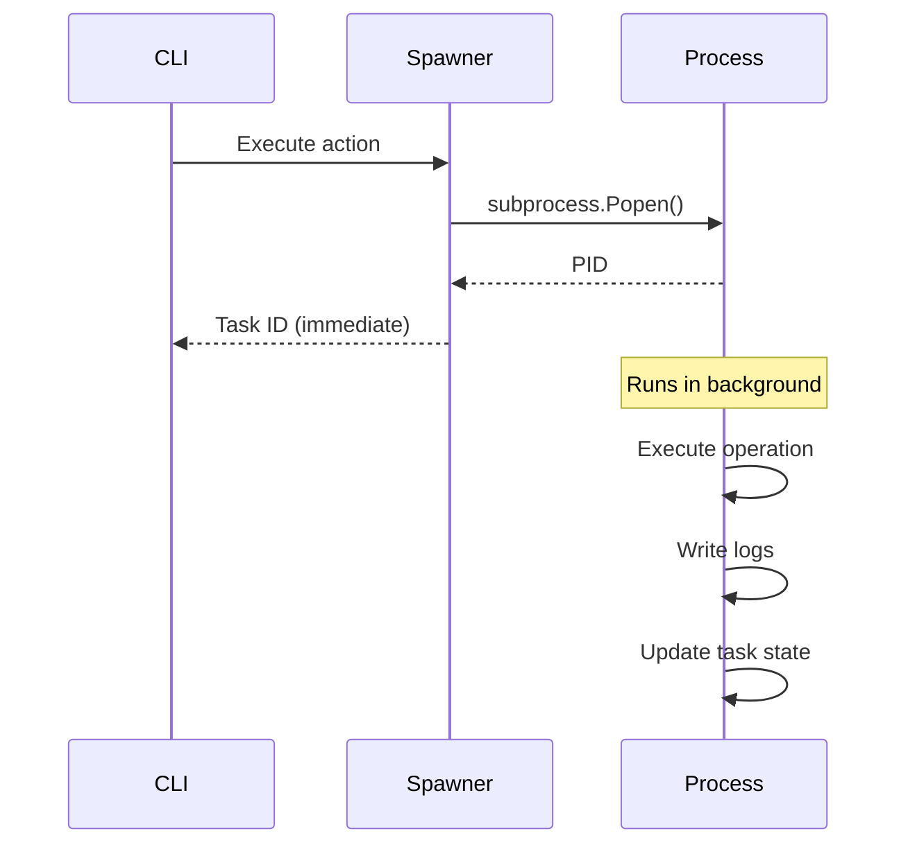

# 9. Architecture Decisions

## 9.1 ADR-001: State Management via Single JSON File

**Status**: Accepted

**Context**: Need persistent state across command invocations for AI assistant workflows

**Decision**: Use single JSON file (`agdt-state.json`) for all state

**Rationale**:

- Simple, human-readable format
- No database dependencies
- Easy to inspect and debug
- Cross-platform compatible
- Fits workflow patterns (sequential commands)

**Consequences**:

- ✅ No external dependencies
- ✅ Easy to debug (just open file)
- ✅ Fast read/write (<20ms)
- ⚠️ Not suitable for high-concurrency scenarios
- ⚠️ Manual locking required

**Alternatives Considered**:

| Alternative | Rejected Because |
|-------------|------------------|
| SQLite | Overkill, adds dependency |
| YAML | Parsing issues, not JSON-compatible |
| Environment variables | Not persistent, limited size |
| Redis | External service, complex setup |

## 9.2 ADR-002: Parameterless Command Pattern

**Status**: Accepted

**Context**: VS Code requires approval for each unique command; parameters make commands unique

**Decision**: Commands read parameters from state file, not CLI arguments

**Rationale**:

- `agdt-set key value` approved once, works for all keys
- `agdt-add-jira-comment` approved once, works for all comments
- AI assistant doesn't need to request approval for each variation

**Consequences**:

- ✅ Excellent UX: ~10 approvals vs 100+
- ✅ Consistent command patterns
- ✅ State inspection via `agdt-show`
- ⚠️ Two-step pattern (set then execute)
- ⚠️ Less discoverable parameters

**Example**:

```bash
# ❌ Bad: Requires approval each time
agdt-add-pull-request-comment --pull-request-id 123 --content "LGTM"
agdt-add-pull-request-comment --pull-request-id 124 --content "Needs work"  # New approval!

# ✅ Good: Approve agdt-set once, reuse forever
agdt-set pull_request_id 123
agdt-set content "LGTM"
agdt-add-pull-request-comment  # Already approved!
```

## 9.3 ADR-003: Background Task Execution

**Status**: Accepted

**Context**: Long API operations (30-60s) block AI agents and appear as failures

**Decision**: Spawn background processes for operations >5 seconds

**Rationale**:

- AI agents can continue with other work
- Clear separation of concerns
- Status monitoring via task commands
- Logs captured to files

**Consequences**:

- ✅ Non-blocking AI workflow
- ✅ Isolated process failures
- ✅ Better error logging
- ⚠️ More complex debugging
- ⚠️ Task monitoring required

**Implementation**:



## 9.4 ADR-004: Multi-Worktree Support

**Status**: Accepted

**Context**: Developers use git worktrees for parallel branch development

**Decision**: Use a single global pip/pipx install of agentic-devtools, shared across all worktrees

**Rationale**:

- Simplifies installation and maintenance
- Single source of truth for command versions
- No per-worktree setup required
- No startup overhead from venv detection

**Consequences**:

- ✅ Zero UX impact
- ✅ Simple installation
- ✅ No re-execution complexity

## 9.5 ADR-005: Workflow State Machine Pattern

**Status**: Accepted

**Context**: Complex multi-step workflows (11+ steps) are hard to manage and resume

**Decision**: Explicit workflow state with step transitions and auto-advancement

**Rationale**:

- Clear workflow progress tracking
- Resumable after failures
- Event-driven transitions
- Prompt generation based on current step

**Consequences**:

- ✅ Resumable workflows
- ✅ Clear progress tracking
- ✅ Step-specific prompts
- ⚠️ State machine complexity
- ⚠️ Event coordination required

**State Structure**:

```json
{
  "workflow": {
    "active": "work-on-jira-issue",
    "status": "active",
    "step": "implementation",
    "context": {
      "issue_key": "DFLY-1234",
      "pull_request_id": 123,
      "checklist": [...]
    }
  }
}
```

## 9.6 ADR-006: Mermaid for All Diagrams

**Status**: Accepted

**Context**: Need diagrams in documentation; must be maintainable and renderable in GitHub

**Decision**: Use Mermaid for all architecture diagrams

**Rationale**:

- Native GitHub rendering
- VS Code extension support
- Text-based (diffable, versionable)
- Simple syntax
- No external tools required

**Consequences**:

- ✅ GitHub native rendering
- ✅ Version control friendly
- ✅ Easy to update
- ⚠️ Limited layout control
- ⚠️ Learning curve for complex diagrams

**Alternatives Considered**:

| Alternative | Rejected Because |
|-------------|------------------|
| PlantUML | Requires external rendering |
| Graphviz | Complex syntax |
| Draw.io | Binary format, not diffable |
| Lucidchart | Commercial, not embeddable |

## 9.7 ADR-007: Argparse-Based CLI

**Status**: Accepted

**Context**: Need robust, auto-approvable CLI with good help text, simple parameter handling, and zero additional runtime dependencies

**Decision**: Use Python's built-in `argparse` module for all CLI commands, with entry points that call implementation functions directly

**Rationale**:

- No third-party dependency required (stdlib only)
- Argparse provides structured parsing, validation, and help generation
- Works well with many small, parameterless commands designed for AI auto-approval
- Easier to reason about and debug than a heavier framework

**Consequences**:

- ✅ Consistent, explicit CLI behavior across all `agdt-*` commands
- ✅ Auto-generated `--help` output from argparse without extra libraries
- ✅ Simple integration with the background task system and state management
- ✅ Easier to vendor or run in constrained environments (no extra dependencies)
- ⚠️ More manual wiring needed for subcommands and shared options compared to a full-featured framework like Click

**Example**:

```python
import argparse

def add_pull_request_comment_async_cli():
    """CLI entry point for adding PR comment."""
    parser = argparse.ArgumentParser(description='Add comment to pull request')
    parser.add_argument('--pull-request-id', type=int, help='PR ID to comment on')
    parser.add_argument('--content', help='Comment content')
    args = parser.parse_args()
    
    # Implementation
    add_pull_request_comment_async(
        pull_request_id=args.pull_request_id,
        content=args.content
    )
```

## 9.8 ADR-008: pyproject.toml for Package Configuration

**Status**: Accepted

**Context**: Need modern Python packaging configuration

**Decision**: Use `pyproject.toml` with PEP 517/518 standards

**Rationale**:

- Modern Python standard
- Centralized configuration
- Tool configuration in one place
- Better than setup.py

**Consequences**:

- ✅ Modern standard
- ✅ Single config file
- ✅ Tool integration (black, pytest, mypy)
- ⚠️ Python 3.8+ required

## 9.9 ADR-009: Dynamic Versioning from Git Tags

**Status**: Accepted

**Context**: Manual version updates in `pyproject.toml` caused PyPI upload failures

**Decision**: Use `hatch-vcs` to derive version from Git tags

**Rationale**:

- Single source of truth (Git tags)
- No manual version updates
- Prevents duplicate version uploads
- Standard practice

**Consequences**:

- ✅ No version sync issues
- ✅ Automatic dev versions
- ✅ Prevents duplicates
- ⚠️ Requires Git tags
- ⚠️ Build-time dependency

**Version Flow**:

```text
Git Tag v0.3.0 → hatch-vcs → Package version 0.3.0
No tag → hatch-vcs → Package version 0.2.9.dev1+g1234abc
```

## 9.10 ADR-010: Azure DevOps as Primary VCS

**Status**: Accepted

**Context**: Dragonfly team uses Azure DevOps for repositories and project management

**Decision**: Azure DevOps integration is first-class; GitHub is secondary

**Rationale**:

- Team's primary platform
- PR reviews in Azure DevOps
- CI/CD pipelines in Azure DevOps
- Work items in Azure DevOps

**Consequences**:

- ✅ Full Azure DevOps feature parity
- ✅ Custom PR review workflow
- ✅ Pipeline trigger commands
- ⚠️ GitHub integration is limited
- ⚠️ Requires Azure DevOps PAT

## 9.11 ADR-011: Test Coverage 95%+ Requirement

**Status**: Accepted

**Context**: Package reliability is critical for AI assistant automation

**Decision**: Require 95%+ test coverage for all code

**Rationale**:

- High confidence in automation
- Catch bugs before production
- Enables safe refactoring
- Forces testable design

**Consequences**:

- ✅ High reliability
- ✅ Safe refactoring
- ✅ Better design
- ⚠️ Slower development
- ⚠️ More test code

**Enforcement**:

```toml
# pyproject.toml
[tool.pytest.ini_options]
addopts = "--cov=agentic_devtools --cov-report=term-missing --cov-fail-under=91"
```

**Note**: Current enforcement is set to 91% coverage. The 95% target remains the aspirational goal for all new code.

## 9.12 ADR-012: Cross-Platform File Locking

**Status**: Accepted

**Context**: State file needs concurrent access protection on Windows, macOS, Linux

**Decision**: Use platform-specific file locking (`msvcrt` on Windows, `fcntl` on Unix)

**Rationale**:

- Native OS support
- No external dependencies
- Reliable locking
- Standard practice

**Consequences**:

- ✅ Cross-platform compatible
- ✅ Reliable concurrency control
- ✅ No dependencies
- ⚠️ Platform-specific code
- ⚠️ Lock timeouts possible

**Implementation**:

```python
import sys

if sys.platform == 'win32':
    import msvcrt
    # Use msvcrt.locking()
else:
    import fcntl
    # Use fcntl.flock()
```

## 9.13 Decision Summary Table

| ADR | Decision | Status | Impact |
|-----|----------|--------|--------|
| 001 | Single JSON state file | ✅ Accepted | Core architecture |
| 002 | Parameterless commands | ✅ Accepted | UX foundation |
| 003 | Background tasks | ✅ Accepted | Performance critical |
| 004 | Multi-worktree support | ✅ Accepted | Developer experience |
| 005 | Workflow state machine | ✅ Accepted | Workflow orchestration |
| 006 | Mermaid diagrams | ✅ Accepted | Documentation |
| 007 | argparse CLI | ✅ Accepted | CLI foundation |
| 008 | pyproject.toml | ✅ Accepted | Package configuration |
| 009 | Dynamic versioning | ✅ Accepted | Release management |
| 010 | Azure DevOps primary | ✅ Accepted | Service integration |
| 011 | 95%+ test coverage | ✅ Accepted | Quality assurance |
| 012 | Cross-platform locking | ✅ Accepted | Concurrency control |
