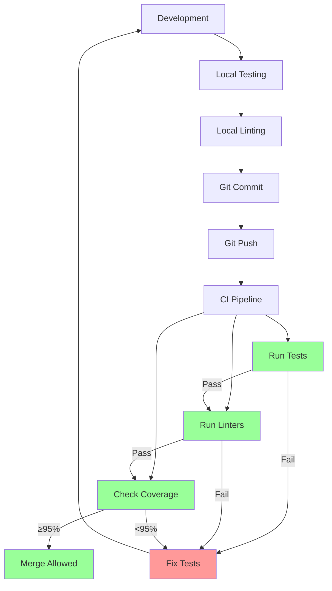

# 10. Quality Requirements

## 10.1 Quality Tree

```mermaid
graph TB
    Quality[Quality Requirements]
    
    Quality --> Usability
    Quality --> Reliability
    Quality --> Performance
    Quality --> Maintainability
    Quality --> Security
    
    Usability --> U1[Auto-approvable commands]
    Usability --> U2[Clear error messages]
    Usability --> U3[Actionable output]
    
    Reliability --> R1[95%+ test coverage]
    Reliability --> R2[Error handling]
    Reliability --> R3[State consistency]
    
    Performance --> P1[Background tasks]
    Performance --> P2[Fast state operations]
    Performance --> P3[Non-blocking AI agents]
    
    Maintainability --> M1[Modular structure]
    Maintainability --> M2[Type hints]
    Maintainability --> M3[Documentation]
    
    Security --> S1[No secrets in code]
    Security --> S2[Environment variables]
    Security --> S3[Sanitized logs]
    
    style Quality fill:#e1f5ff
    style Usability fill:#9f9
    style Reliability fill:#9f9
    style Performance fill:#ff9
    style Maintainability fill:#ff9
    style Security fill:#f99
```



## 10.2 Quality Scenarios

### 10.2.1 Usability

#### US-1: One-Time Command Approval

**Scenario**: AI assistant needs to add comments to multiple PRs

**Stimulus**: Execute `agdt-add-pull-request-comment` for different PRs

**Response**: Command requires approval only once

**Measure**:

- ✅ Success: Single approval for unlimited uses
- ❌ Failure: Requires approval per PR

**Priority**: Critical

**Implementation**:

```bash
# Approve once
agdt-set pull_request_id 123
agdt-set content "LGTM"
agdt-add-pull-request-comment  # First approval

# Reuse forever
agdt-set pull_request_id 456
agdt-set content "Needs work"
agdt-add-pull-request-comment  # No approval needed!
```

#### US-2: Clear Error Messages

**Scenario**: Command fails due to missing state

**Stimulus**: Execute `agdt-add-jira-comment` without setting `jira.issue_key`

**Response**: Error message shows exactly what's missing and how to fix

**Measure**:

- ✅ Success: Message includes required key and example command
- ❌ Failure: Generic "missing parameter" message

**Example**:

```text
❌ Error: Missing required state key: jira.issue_key
   Run: agdt-set jira.issue_key DFLY-1234
```

#### US-3: Actionable Output

**Scenario**: Background task starts

**Stimulus**: Execute `agdt-add-jira-comment`

**Response**: Output tells user how to monitor task

**Measure**:

- ✅ Success: Shows task ID and monitoring commands
- ❌ Failure: Just shows "task started"

**Example**:

```text
✓ Background task started: 550e8400-e29b-41d4-a716-446655440000
  Status: agdt-task-status
  Logs: agdt-task-log
  Wait: agdt-task-wait
```

### 10.2.2 Reliability

#### RE-1: State Consistency Under Concurrent Access

**Scenario**: Two commands access state simultaneously

**Stimulus**: Run `agdt-set` in two terminals at the same time

**Response**: Both complete successfully without data loss

**Measure**:

- ✅ Success: Both writes persisted correctly
- ❌ Failure: One write lost or state corrupted

**Implementation**: File locking with retry

#### RE-2: Graceful API Failure Handling

**Scenario**: External API returns 500 error

**Stimulus**: Execute `agdt-get-jira-issue` when Jira is down

**Response**: Clear error message, non-zero exit code, task state updated

**Measure**:

- ✅ Success: Error logged, task marked failed, helpful message
- ❌ Failure: Crash or hang

**Example**:

```text
❌ Error: Jira API request failed (500 Internal Server Error)
   The Jira service may be temporarily unavailable.
   Try again in a few minutes or check status.atlassian.com
```

#### RE-3: Test Coverage

**Scenario**: New code added

**Stimulus**: Run test suite

**Response**: Coverage remains ≥95%

**Measure**:

- ✅ Success: 95%+ coverage, all tests pass
- ❌ Failure: Coverage drops below 95%

**Enforcement**: CI pipeline currently blocks merge if coverage <90% (target coverage remains ≥95%)

### 10.2.3 Performance

#### PE-1: Background Task Responsiveness

**Scenario**: Long API operation (30+ seconds)

**Stimulus**: Execute `agdt-get-pull-request-details`

**Response**: Command returns immediately with task ID

**Measure**:

- ✅ Success: Returns in <1 second
- ❌ Failure: Blocks for full 30 seconds

**Threshold**: All operations >5 seconds must be background tasks

#### PE-2: State File Operations

**Scenario**: Read state value

**Stimulus**: Execute `agdt-get key`

**Response**: Returns value quickly

**Measure**:

- ✅ Success: <50ms for typical state file (<100KB)
- ❌ Failure: >500ms

**Implementation**: Direct JSON read, no parsing overhead

#### PE-3: Non-Blocking AI Workflow

**Scenario**: AI assistant executes workflow

**Stimulus**: Start `work-on-jira-issue` workflow

**Response**: AI can continue to next step while background tasks run

**Measure**:

- ✅ Success: Workflow completes in <2 minutes of AI time
- ❌ Failure: AI waits >5 minutes for tasks

**Pattern**: Spawn, continue, check later

### 10.2.4 Maintainability

#### MA-1: Modular Command Addition

**Scenario**: Add new Jira command

**Stimulus**: Developer creates new CLI command

**Response**: Command integrates cleanly with existing patterns

**Measure**:

- ✅ Success: <100 lines of code, follows patterns
- ❌ Failure: Requires modifying core infrastructure

**Steps**:

1. Create function in `jira/commands.py`
2. Add entry point in `pyproject.toml`
3. Write tests
4. Done!

#### MA-2: Type Safety

**Scenario**: Refactor function signature

**Stimulus**: Change parameter type

**Response**: Type checker catches all call sites

**Measure**:

- ✅ Success: mypy reports all type mismatches
- ❌ Failure: Runtime errors

**Requirement**: All functions have type hints

#### MA-3: Documentation Quality

**Scenario**: New developer joins team

**Stimulus**: Read documentation to understand architecture

**Response**: Clear understanding in <2 hours

**Measure**:

- ✅ Success: Can explain main concepts and modify code
- ❌ Failure: Confused about core concepts

**Standard**: arc42 documentation kept up-to-date

### 10.2.5 Security

#### SE-1: No Secrets in Code

**Scenario**: Code review

**Stimulus**: Search codebase for credentials

**Response**: No secrets found

**Measure**:

- ✅ Success: Zero hardcoded secrets
- ❌ Failure: Any credential found

**Enforcement**: Manual code review, CI scan

#### SE-2: Environment Variable Credentials

**Scenario**: Execute command needing authentication

**Stimulus**: Run `agdt-add-jira-comment`

**Response**: Reads token from environment variable

**Measure**:

- ✅ Success: Token from `JIRA_COPILOT_PAT`
- ❌ Failure: Token from state file or config

**Pattern**:

```python
token = os.environ.get('JIRA_COPILOT_PAT')
if not token:
    raise ValueError('JIRA_COPILOT_PAT not set')
```

#### SE-3: Sanitized Logs

**Scenario**: Background task logs API request

**Stimulus**: Execute `agdt-add-jira-comment`

**Response**: Logs show operation but not token

**Measure**:

- ✅ Success: Log shows URL and method, not auth header
- ❌ Failure: Token appears in log

**Example**:

```text
# ✅ Good
[2026-02-13 10:30:00] POST https://api.atlassian.com/issue/DFLY-1234/comment

# ❌ Bad
[2026-02-13 10:30:00] POST https://api.atlassian.com/issue/DFLY-1234/comment
Authorization: Bearer abc123xyz...
```

## 10.3 Quality Metrics

| Metric | Target | Actual | Measurement |
|--------|--------|--------|-------------|
| **Test Coverage** | ≥95% | Check in CI | pytest-cov |
| **Command Approvals** | ≤15 unique | ~10 | Manual count |
| **Background Task Overhead** | <1s | ~200ms | Time measurement |
| **State Read Time** | <50ms | ~10ms | Profiling |
| **State Write Time** | <100ms | ~20ms | Profiling |
| **API Error Handling** | 100% caught | 100% | Test suite |
| **Type Hint Coverage** | 100% | 95%+ | mypy |
| **Documentation Completeness** | All sections | ✓ | Manual review |

## 10.4 Quality Assurance Process



## 10.5 Acceptance Criteria

### For New Commands

- [ ] Follows parameterless pattern (reads from state)
- [ ] Has background task for operations >5s
- [ ] Has clear error messages with examples
- [ ] Has actionable output format
- [ ] Has type hints on all functions
- [ ] Has docstrings with examples
- [ ] Has unit tests with 95%+ coverage
- [ ] Has integration test (if applicable)
- [ ] Has entry point in `pyproject.toml`
- [ ] Documented in appropriate module README

### For New Workflows

- [ ] Has step-by-step prompt templates
- [ ] Has state machine definition
- [ ] Has auto-advancement logic
- [ ] Has resume capability
- [ ] Has Copilot Chat agent file
- [ ] Has workflow documentation
- [ ] Has integration test
- [ ] Follows existing workflow patterns

### For Documentation Changes

- [ ] Follows arc42 structure
- [ ] Uses Mermaid for diagrams
- [ ] Passes markdownlint
- [ ] Cross-references related sections
- [ ] Updates glossary for new terms
- [ ] Updates README if needed

### For Bug Fixes

- [ ] Root cause identified
- [ ] Fix implemented with minimal changes
- [ ] Regression test added
- [ ] Related code reviewed
- [ ] Documentation updated if needed
