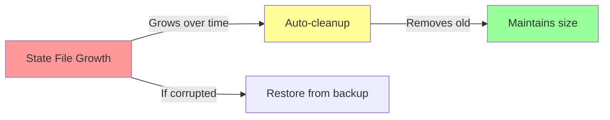
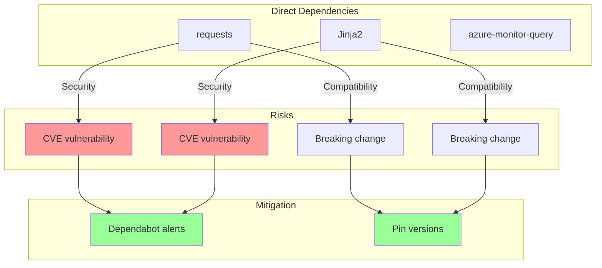
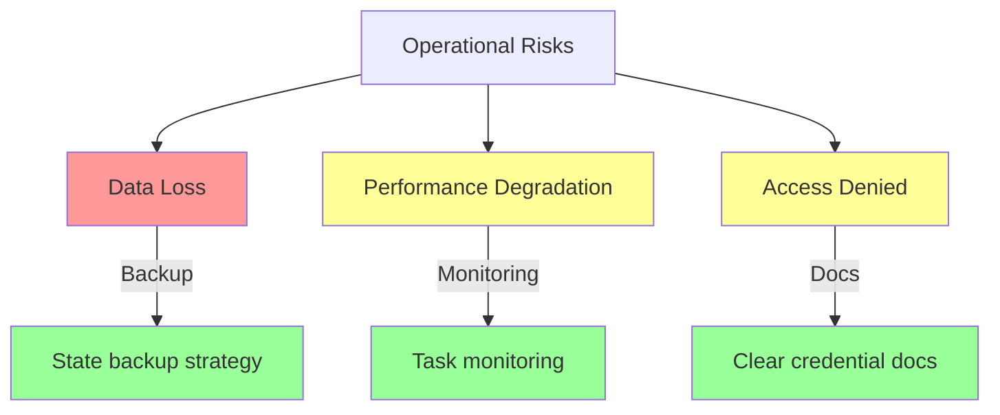
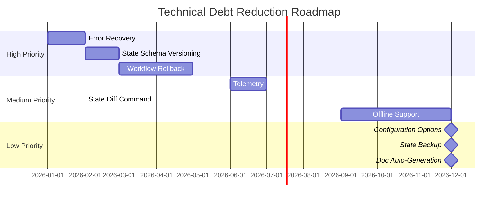

# 11. Risks and Technical Debt

## 11.1 Current Risks

### 11.1.1 High Priority Risks

#### RISK-001: Single JSON State File Scalability

**Risk**: State file becomes too large or corrupted

**Probability**: Medium

**Impact**: High

**Mitigation**:

- Regular state cleanup via `agdt-clear`
- Background task expiry (24 hours)
- File size monitoring
- Backup mechanism consideration

**Current Status**: State files typically <100KB; manageable for foreseeable use



#### RISK-002: Azure DevOps API Changes

**Risk**: Azure DevOps REST API breaking changes

**Probability**: Low

**Impact**: High

**Mitigation**:

- Pin to specific API version (v7.0)
- Monitor Azure DevOps deprecation notices
- Integration tests catch API changes
- Graceful error handling

**Current Status**: API v7.0 stable; monitoring for v8.0 announcements

#### RISK-003: Concurrent State Access Deadlocks

**Risk**: File locking causes deadlock or timeout

**Probability**: Low

**Impact**: Medium

**Mitigation**:

- Lock timeout with retry loop (5s timeout, 10ms fixed sleep interval)
- Clear error messages on timeout
- Lock release in finally blocks
- Context manager pattern enforced

**Current Status**: No deadlocks observed; lock uses 5s timeout with tight retry loop (10ms sleep, no exponential backoff)

### 11.1.2 Medium Priority Risks

#### RISK-004: Background Task Orphans

**Risk**: Background processes fail to clean up

**Probability**: Medium

**Impact**: Low

**Mitigation**:

- Task expiry (24 hours)
- `agdt-tasks-clean` command
- PID tracking and validation
- Automatic cleanup on next task spawn

**Current Status**: Cleanup command available; considering automatic cleanup

#### RISK-005: Environment Variable Security

**Risk**: Credentials exposed via environment variables

**Probability**: Low

**Impact**: High

**Mitigation**:

- Never log environment variables
- Clear documentation on credential handling
- Recommend OS keystore integration
- Process isolation

**Current Status**: Environment variables remain best practice for CLI tools

#### RISK-006: Multi-Worktree Version Conflicts

**Risk**: Different worktrees use incompatible versions

**Probability**: Medium

**Impact**: Medium

**Mitigation**:

- State schema versioning
- Backward compatibility testing
- Clear upgrade path documentation
- Version detection in dispatcher

**Current Status**: Version detection not yet implemented

### 11.1.3 Low Priority Risks

#### RISK-007: Rate Limiting by External APIs

**Risk**: External APIs throttle or block requests

**Probability**: Medium

**Impact**: Low

**Mitigation**:

- Respect API rate limits
- Exponential backoff on 429 responses
- Clear error messages
- Consider rate limit caching

**Current Status**: No rate limit issues observed

#### RISK-008: Large PR Diff Processing

**Risk**: Very large PRs cause memory issues

**Probability**: Low

**Impact**: Low

**Mitigation**:

- Stream processing for large diffs
- Configurable diff size limits
- Pagination for file lists
- Background task memory limits

**Current Status**: Largest PR tested: ~5000 lines; no issues

## 11.2 Technical Debt

### 11.2.1 High Priority Debt

#### DEBT-001: Limited Error Recovery

**Description**: Most errors are fatal; no automatic retry logic

**Impact**: User must manually retry failed operations

**Effort**: Medium

**Proposed Solution**:

- Add retry decorator for API calls
- Implement exponential backoff
- Store retry state in task metadata

**Timeline**: Q1 2026

```python
# Proposed pattern
@retry(max_attempts=3, backoff=exponential)
def call_api(url):
    response = requests.get(url)
    response.raise_for_status()
    return response
```

#### DEBT-002: No State Schema Versioning

**Description**: State file has no version field; migration is manual

**Impact**: Breaking changes require users to clear state

**Effort**: Medium

**Proposed Solution**:

- Add `_version` field to state
- Implement migration functions
- Auto-migrate on load

**Timeline**: Q2 2026

```json
{
  "_version": "2.0",
  "_workflow": {...},
  "key": "value"
}
```

#### DEBT-003: Limited Workflow Rollback

**Description**: No way to undo workflow steps

**Impact**: Mistakes require manual cleanup

**Effort**: High

**Proposed Solution**:

- Store action history in workflow context
- Implement undo operations
- Add `agdt-workflow-rollback` command

**Timeline**: Q2 2026

### 11.2.2 Medium Priority Debt

#### DEBT-004: No Telemetry or Analytics

**Description**: No usage metrics or error reporting

**Impact**: Can't identify common issues or usage patterns

**Effort**: Medium

**Proposed Solution**:

- Optional telemetry with user consent
- Local metrics file
- Privacy-first design

**Timeline**: Q3 2026

#### DEBT-005: Limited Offline Support

**Description**: Most commands require internet connectivity

**Impact**: Can't work offline or in restricted networks

**Effort**: High

**Proposed Solution**:

- Cache API responses
- Offline-first state operations
- Queue commands for later execution

**Timeline**: Q4 2026

#### DEBT-006: No State Diff Command

**Description**: Hard to see what changed in state

**Impact**: Debugging state changes is difficult

**Effort**: Low

**Proposed Solution**:

- Add `agdt-diff` command
- Show state changes over time
- Implement state history (last N changes)

**Timeline**: Q1 2026

```bash
# Proposed command
agdt-diff --since "5 minutes ago"
# Output:
# + jira.issue_key = "DFLY-1234"
# - pull_request_id = 123
# ~ commit_message = "feat: old" → "feat: new"
```

### 11.2.3 Low Priority Debt

#### DEBT-007: Limited Configuration Options

**Description**: Most behavior is hardcoded; no user configuration file

**Impact**: Users can't customize behavior

**Effort**: Medium

**Proposed Solution**:

- Add `~/.agdt/config.toml`
- Support project-level `.agdt.toml`
- Override with environment variables

**Timeline**: Backlog

#### DEBT-008: No Built-in State Backup

**Description**: State loss requires manual recreation

**Impact**: Accidental state corruption is irrecoverable

**Effort**: Low

**Proposed Solution**:

- Auto-backup on state write
- Keep last N backups
- Add `agdt-restore` command

**Timeline**: Backlog

#### DEBT-009: Limited Documentation Auto-Generation

**Description**: Command help is manually written

**Impact**: Help may diverge from implementation

**Effort**: Low

**Proposed Solution**:

- Generate help from docstrings
- Auto-generate command reference
- CI check for docs/code sync

**Timeline**: Backlog

## 11.3 Dependency Risks



| Dependency | Risk Level | Mitigation |
|------------|-----------|------------|
| **requests** | Low | Stable API, wide usage, security updates frequent |
| **Jinja2** | Low | Stable API, wide usage, pin to major version |
| **azure-monitor-query** | Medium | Microsoft-maintained, Azure SDK, regular updates |
| **hatch-vcs** | Medium | Build-time only, can be replaced |

## 11.4 Compliance and Licensing

**Current Status**: MIT License

**Risks**:

- ✅ No GPL dependencies (would require copyleft)
- ✅ All dependencies are permissive (MIT, Apache 2.0, BSD)
- ✅ No patent issues identified

**Monitoring**: Automated license scanning in CI (future)

## 11.5 Operational Risks



## 11.6 Risk Monitoring

### Automated Monitoring

- [ ] CI test failures
- [ ] Test coverage drops
- [ ] Dependency vulnerabilities (Dependabot)
- [ ] Markdown lint failures
- [ ] Type check failures

### Manual Monitoring

- [ ] Azure DevOps API deprecation notices
- [ ] Jira API changes
- [ ] User-reported issues
- [ ] State file size growth
- [ ] Background task failures

## 11.7 Debt Reduction Strategy



## 11.8 Risk Acceptance

Some risks are accepted as part of the design:

| Risk | Acceptance Rationale |
|------|----------------------|
| **Single JSON file** | Appropriate for sequential CLI usage; complexity not justified |
| **Environment variable credentials** | Industry standard for CLI tools; better alternatives are complex |
| **No GUI** | CLI-first design; GUI would complicate automation |
| **English only** | Team works in English; i18n not currently needed |
| **Azure DevOps focus** | Team's primary platform; GitHub is secondary |

## 11.9 Future Considerations

Areas to monitor for future development:

1. **GraphQL APIs**: Azure DevOps and Jira offer GraphQL; consider migration
2. **Container Support**: Package as Docker image for isolated execution
3. **Plugin System**: Allow third-party extensions
4. **Web UI**: Optional web interface for state inspection
5. **Cloud State**: Optional cloud state storage for team collaboration
