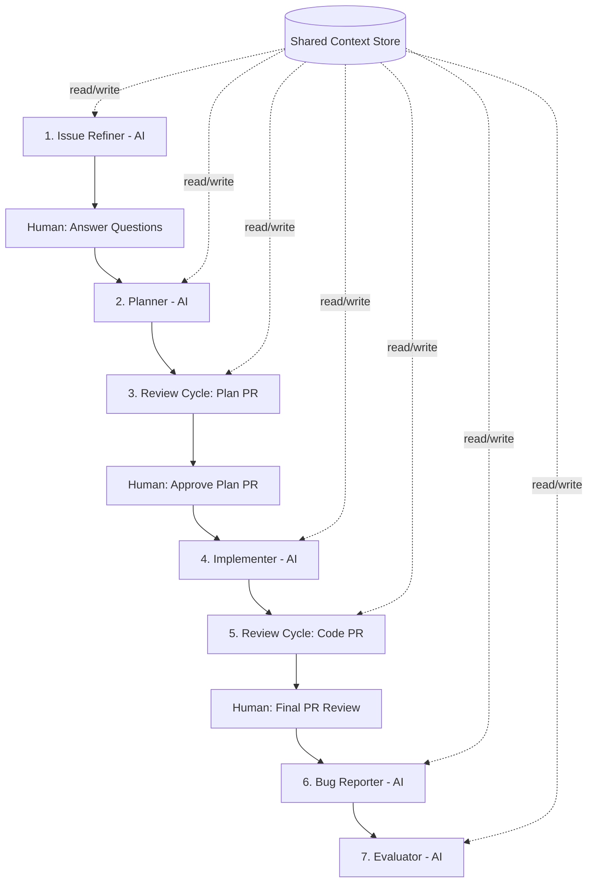
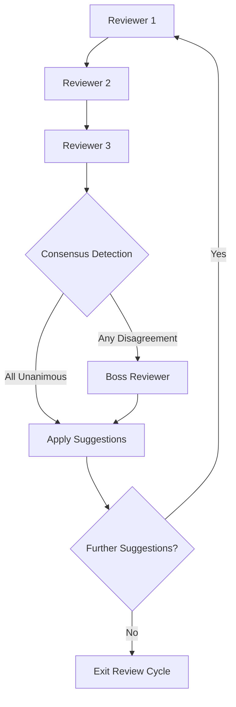

# Orchestration Framework Evaluation for Agentic-Devtools

## Executive Summary

This document evaluates seven candidate orchestration frameworks for serving as
the core execution engine of Agentic-Devtools (AGDT). After assessing each
against AGDT's specific requirements — persistent shared state, deterministic
orchestration, a deliberative multi-reviewer consensus pattern, configurable
human-in-the-loop gates, and local CLI execution — the recommendation is
**LangGraph**.

LangGraph provides the strongest alignment with AGDT's architecture: a low-level,
graph-based orchestration model where the application controls all routing,
built-in checkpointing with SQLite persistence that survives across sessions,
native support for cycles (required for the review loop), and a lightweight
dependency footprint under an MIT license. While a custom orchestrator would
offer maximum control, LangGraph delivers equivalent flexibility with
substantially less implementation effort and a mature persistence layer that
would take months to replicate.

## Methodology

Each candidate framework was evaluated through documentation-based analysis using the following approach:

1. **Requirements mapping**: Each of AGDT's 9 "Must Have" and 4 "Nice to Have" criteria was assessed against the framework's published documentation, API surface, and architectural design.
2. **Scoring**: Each criterion receives a ✅ (fully meets), ⚠️ (partially meets with workarounds), or ❌ (does not meet or fundamentally misaligned).
3. **Integration sketches**: For the top 2 candidates, illustrative Python pseudocode demonstrates how AGDT's pipeline and deliberative review cycle would map to the framework's API.
4. **Maintenance signals**: Last release date, commit activity, contributor count, and dependency weight are presented as data points without imposing arbitrary cutoffs.
5. **Verdict**: Each candidate receives a clear go/no-go recommendation for AGDT.

Data was gathered from official documentation, PyPI package metadata, GitHub repository statistics, and community resources as of March 2026.

## AGDT Requirements Recap

AGDT is evolving from a CLI helper into a full workflow orchestration layer for AI-assisted development. The target architecture has two core patterns that any framework must support.

### Issue Lifecycle Pipeline



### Deliberative Review Cycle Pattern



### Must Have Criteria

| # | Criterion | Description |
|---|-----------|-------------|
| M1 | Shared persistent state | All agents read/write structured history, queryable, survives across sessions hours/days apart |
| M2 | Deterministic orchestration | AGDT controls all routing; AI agents never decide which tool, platform, or API to use |
| M3 | Deliberative multi-reviewer | Sequential multi-reviewer execution where each reviewer sees previous reviews |
| M4 | Configurable review loops | Review cycle repeats until no suggestions; same pattern reusable for plan and code PRs |
| M5 | Human-in-the-loop gates | Per-repo configurable points where humans must approve |
| M6 | Local CLI execution | No cloud dependency, installable via pipx/pip |
| M7 | Structured audit trail | Per-issue, per-step, per-agent, timestamped with full inputs/outputs |
| M8 | AI as focused function nodes | Agents receive prepared context, return creative artifact; no routing decisions |
| M9 | MIT or compatible license | Actively maintained |

### Nice to Have Criteria

| # | Criterion | Description |
|---|-----------|-------------|
| N1 | Checkpoint/resume | Mid-workflow recovery after crash or machine restart |
| N2 | Visualization | Workflow graph visualization |
| N3 | Simple Python integration | Decorators, functions, not heavy DSL |
| N4 | Low learning curve | Easy for contributors to understand and extend |

## Per-Framework Deep Dive

### LangGraph (LangChain)

**Overview**: LangGraph is a low-level orchestration library from the LangChain
ecosystem for building stateful, multi-actor applications as graphs. Unlike
higher-level agent frameworks, LangGraph gives the application full control over
routing, state, and agent invocation. Nodes are Python functions; edges define
control flow (including conditional branching and cycles).

**Strengths**:

- **Graph-based with cycles**: Native support for cyclic graphs, essential for the review loop pattern
- **Application-controlled routing**: Conditional edges are Python functions — AGDT decides where execution flows, not the AI
- **Built-in checkpointing**: `SqliteSaver`, `PostgresSaver`, and `InMemorySaver` provide persistent state that survives across sessions, with thread-based isolation per issue
- **Human-in-the-loop**: First-class `interrupt()` primitive that pauses graph execution and resumes from checkpoint
- **Lightweight core**: ~6 direct dependencies, ~10–30 MB install footprint
- **MIT license**: Permissive, compatible with AGDT's requirements
- **Active maintenance**: Regular releases (v1.1.1 as of early 2026), large contributor base, adopted by major companies

**Weaknesses**:

- **LangChain ecosystem coupling**: Depends on `langchain-core` — though this is lightweight, it ties AGDT to the LangChain serialization and type system
- **Learning curve for graph concepts**: Contributors need to understand `StateGraph`, channels, and reducers
- **Checkpoint schema evolution**: Long-running workflows spanning days may need migration handling if the checkpoint format changes between LangGraph versions

**Criterion-by-Criterion Assessment**:

| Criterion | Rating | Notes |
|-----------|--------|-------|
| M1: Shared persistent state | ✅ | `SqliteSaver` provides durable, queryable checkpoints per thread_id (= per issue). State survives restarts. |
| M2: Deterministic orchestration | ✅ | Conditional edges are plain Python functions. AGDT controls all routing. |
| M3: Deliberative multi-reviewer | ✅ | Sequential node execution with state accumulation. Each reviewer node reads previous reviews from graph state. |
| M4: Configurable review loops | ✅ | Cyclic graphs with conditional exit edges. Same subgraph reusable for plan and code review. |
| M5: Human-in-the-loop gates | ✅ | `interrupt()` pauses execution; `Command(resume=...)` continues from checkpoint. |
| M6: Local CLI execution | ✅ | Pure Python library, no server required. `pip install langgraph`. |
| M7: Structured audit trail | ✅ | Checkpoints store full state at every step, timestamped, queryable. Custom state schema adds agent metadata. |
| M8: AI as function nodes | ✅ | Nodes are plain Python functions. AGDT prepares context, calls AI, returns artifact. |
| M9: License & maintenance | ✅ | MIT license. Active development, regular releases, 200+ contributors. |
| N1: Checkpoint/resume | ✅ | Core feature — resume from any checkpoint after crash. |
| N2: Visualization | ✅ | Built-in `graph.get_graph().draw_mermaid()` for Mermaid output. |
| N3: Simple Python integration | ⚠️ | Functions as nodes, but requires understanding StateGraph/channels. Not as simple as plain decorators. |
| N4: Low learning curve | ⚠️ | Graph concepts have a ramp-up period; well-documented but not trivial. |

**Integration Pseudocode**:

```python
# === AGDT Issue Pipeline with LangGraph ===
from typing import TypedDict, Annotated
from langgraph.graph import StateGraph, END
from langgraph.checkpoint.sqlite import SqliteSaver
from langgraph.types import interrupt, Command

# --- State Schema ---
class IssueState(TypedDict):
    issue_key: str
    raw_description: str
    refined_description: str
    clarifying_questions: list[str]
    human_answers: list[str]
    implementation_plan: str
    plan_reviews: list[dict]       # [{reviewer, suggestions, positions}]
    plan_consensus: dict           # {unanimous: [...], escalated: [...]}
    boss_decisions: list[dict]
    code_changes: str
    code_reviews: list[dict]
    code_consensus: dict
    code_boss_decisions: list[dict]
    bug_reports: list[dict]
    evaluation: dict
    audit_trail: Annotated[list[dict], lambda a, b: a + b]  # append-only
    review_iteration: int

# --- Node Functions ---
def issue_refiner(state: IssueState) -> dict:
    """AI generates clarifying questions from raw description."""
    questions = call_ai("refine_issue", context=state["raw_description"])
    return {
        "clarifying_questions": questions,
        "audit_trail": [{"agent": "refiner", "action": "questions", "output": questions}],
    }

def human_answers_gate(state: IssueState) -> dict:
    """Pause for human to answer clarifying questions."""
    answers = interrupt({"questions": state["clarifying_questions"]})
    refined = call_ai("refine_with_answers", questions=state["clarifying_questions"], answers=answers)
    return {
        "human_answers": answers,
        "refined_description": refined,
        "audit_trail": [{"agent": "refiner", "action": "refined", "output": refined}],
    }

def planner(state: IssueState) -> dict:
    """AI creates implementation plan from refined issue."""
    plan = call_ai("create_plan", issue=state["refined_description"])
    return {
        "implementation_plan": plan,
        "audit_trail": [{"agent": "planner", "action": "plan", "output": plan}],
    }

# --- Deliberative Review Cycle (reusable subgraph) ---
def build_review_subgraph(artifact_key: str, reviews_key: str, consensus_key: str, boss_key: str):
    """Build a reusable review cycle subgraph."""

    def reviewer_1(state):
        artifact = state[artifact_key]
        review = call_ai("review", artifact=artifact, reviewer_id=1, previous_reviews=[])
        reviews = [review]
        return {reviews_key: reviews, "review_iteration": state.get("review_iteration", 0) + 1}

    def reviewer_2(state):
        artifact = state[artifact_key]
        prev = state[reviews_key]
        review = call_ai("review", artifact=artifact, reviewer_id=2, previous_reviews=prev)
        return {reviews_key: prev + [review]}

    def reviewer_3(state):
        artifact = state[artifact_key]
        prev = state[reviews_key]
        review = call_ai("review", artifact=artifact, reviewer_id=3, previous_reviews=prev)
        return {reviews_key: prev + [review]}

    def consensus_detection(state):
        """Deterministic: AGDT logic, no AI involved."""
        reviews = state[reviews_key]
        unanimous, escalated = detect_consensus(reviews)  # pure Python
        return {consensus_key: {"unanimous": unanimous, "escalated": escalated}}

    def should_escalate(state) -> str:
        if state[consensus_key]["escalated"]:
            return "boss"
        return "apply"

    def boss_reviewer(state):
        review = call_ai("boss_review", escalated=state[consensus_key]["escalated"],
                         all_reviews=state[reviews_key])
        return {boss_key: [review]}

    def apply_suggestions(state):
        suggestions = state[consensus_key]["unanimous"]
        if state.get(boss_key):
            suggestions += state[boss_key][-1].get("decisions", [])
        updated = call_ai("apply_suggestions", artifact=state[artifact_key], suggestions=suggestions)
        return {artifact_key: updated, reviews_key: []}  # reset reviews for next iteration

    def should_continue(state) -> str:
        """Exit when no suggestions were produced. Configurable max iteration assumed."""
        MAX_ITERATIONS = get_config("max_review_iterations", default=5)
        consensus = state[consensus_key]
        if not consensus["unanimous"] and not consensus["escalated"]:
            return "done"
        if state.get("review_iteration", 0) >= MAX_ITERATIONS:
            return "done"
        return "continue"

    sg = StateGraph(IssueState)
    sg.add_node("reviewer_1", reviewer_1)
    sg.add_node("reviewer_2", reviewer_2)
    sg.add_node("reviewer_3", reviewer_3)
    sg.add_node("consensus", consensus_detection)
    sg.add_node("boss", boss_reviewer)
    sg.add_node("apply", apply_suggestions)

    sg.set_entry_point("reviewer_1")
    sg.add_edge("reviewer_1", "reviewer_2")
    sg.add_edge("reviewer_2", "reviewer_3")
    sg.add_edge("reviewer_3", "consensus")
    sg.add_conditional_edges("consensus", should_escalate, {"boss": "boss", "apply": "apply"})
    sg.add_edge("boss", "apply")
    sg.add_conditional_edges("apply", should_continue, {"continue": "reviewer_1", "done": END})

    return sg.compile()

# --- Main Pipeline Graph ---
def build_pipeline():
    graph = StateGraph(IssueState)

    graph.add_node("refiner", issue_refiner)
    graph.add_node("human_answers", human_answers_gate)
    graph.add_node("planner", planner)
    graph.add_node("plan_review", build_review_subgraph(
        "implementation_plan", "plan_reviews", "plan_consensus", "boss_decisions"))
    graph.add_node("human_plan_approval", lambda s: interrupt({"plan": s["implementation_plan"]}))
    graph.add_node("implementer", implementer)
    graph.add_node("code_review", build_review_subgraph(
        "code_changes", "code_reviews", "code_consensus", "code_boss_decisions"))
    graph.add_node("human_code_approval", lambda s: interrupt({"code": s["code_changes"]}))
    graph.add_node("bug_reporter", bug_reporter)
    graph.add_node("evaluator", evaluator)

    graph.set_entry_point("refiner")
    graph.add_edge("refiner", "human_answers")
    graph.add_edge("human_answers", "planner")
    graph.add_edge("planner", "plan_review")
    graph.add_edge("plan_review", "human_plan_approval")
    graph.add_edge("human_plan_approval", "implementer")
    graph.add_edge("implementer", "code_review")
    graph.add_edge("code_review", "human_code_approval")
    graph.add_edge("human_code_approval", "bug_reporter")
    graph.add_edge("bug_reporter", "evaluator")
    graph.add_edge("evaluator", END)

    checkpointer = SqliteSaver.from_conn_string(".agdt/workflows/checkpoints.db")
    return graph.compile(checkpointer=checkpointer)

# --- Execution ---
pipeline = build_pipeline()

# Start a new issue workflow (thread_id = issue key for isolation)
config = {"configurable": {"thread_id": "PROJECT-1234"}}
result = pipeline.invoke({"issue_key": "PROJECT-1234", "raw_description": "..."}, config)

# Resume after human answers questions (hours/days later)
pipeline.invoke(Command(resume={"answers": ["answer1", "answer2"]}), config)
```

**Dependency & Maintenance Profile**:

| Metric | Value |
|--------|-------|
| PyPI package | `langgraph` |
| Latest version | 1.1.1 (March 2026) |
| Direct dependencies | ~6 (langchain-core, langgraph-checkpoint, langgraph-sdk, pydantic, xxhash, langgraph-prebuilt) |
| Install size | ~10–30 MB |
| License | MIT |
| GitHub stars | ~15,000+ |
| Contributors | 200+ |
| Last release | March 2026 |

**Verdict**: ✅ **Go** — Best overall fit for AGDT. Graph-based orchestration
with cycles, built-in persistence, human-in-the-loop, and application-controlled
routing directly map to every AGDT requirement.

---

### CrewAI

**Overview**: CrewAI is a high-level framework for orchestrating role-playing AI
agents organized into "Crews" (agent teams) and "Flows" (event-driven workflows).
Agents are defined with roles, goals, and backstories, and collaborate on tasks.

**Strengths**:

- **Role-based agent modeling**: Natural fit for naming reviewer agents with distinct roles
- **Flows with persistence**: `@persist` decorator enables state persistence across sessions
- **Sequential and parallel execution**: Built-in support for task orchestration patterns
- **Active community**: ~45,800 GitHub stars, MIT license, frequent releases
- **Low barrier to entry**: YAML-based agent configuration, high-level abstractions

**Weaknesses**:

- **Agent autonomy by design**: CrewAI agents are designed to make their own tool and routing decisions — fundamentally opposed to AGDT's deterministic orchestration requirement
- **LLM-driven routing**: Task delegation is controlled by the AI, not the application. Overriding this requires fighting the framework's core design
- **Limited control over execution flow**: The framework abstracts away the
  graph/DAG level — conditional logic and cycles must be implemented through
  Flow event listeners rather than explicit graph edges
- **Heavy dependencies**: Pulls in `openai`, `docker`, and other packages even if unused
- **Opinionated structure**: YAML config files, project scaffolding assumes CrewAI owns the application structure

**Criterion-by-Criterion Assessment**:

| Criterion | Rating | Notes |
|-----------|--------|-------|
| M1: Shared persistent state | ⚠️ | Flow `@persist` saves state, but schema is Flow-specific. Cross-session structured querying requires custom wrapper. |
| M2: Deterministic orchestration | ❌ | Agents decide tool use and delegation. Overriding this fights the framework's core design. |
| M3: Deliberative multi-reviewer | ⚠️ | Sequential tasks possible, but reviewers would need to be modeled as tasks within a crew, not as controlled nodes. |
| M4: Configurable review loops | ⚠️ | Flows support loops via event listeners, but cycle control is less explicit than graph-based approaches. |
| M5: Human-in-the-loop gates | ⚠️ | `human_input=True` on agents, but gate placement is per-agent, not per-workflow-step. |
| M6: Local CLI execution | ✅ | `pip install crewai`, runs locally. |
| M7: Structured audit trail | ⚠️ | Logging and tracing available via CrewAI AMP, but structured per-step audit requires custom implementation. |
| M8: AI as function nodes | ❌ | Agents are autonomous by design. Reducing them to pure function nodes eliminates CrewAI's value proposition. |
| M9: License & maintenance | ✅ | MIT license. Very active (45k+ stars, regular releases). |
| N1: Checkpoint/resume | ⚠️ | Flow persistence supports resume, but not at arbitrary graph steps. |
| N2: Visualization | ⚠️ | Some visualization through CrewAI AMP Suite, not built into the core library. |
| N3: Simple Python integration | ✅ | Decorators and YAML config make setup straightforward. |
| N4: Low learning curve | ✅ | High-level API, good documentation, quick start guides. |

**Dependency & Maintenance Profile**:

| Metric | Value |
|--------|-------|
| PyPI package | `crewai` |
| Latest version | 1.10.x (early 2026) |
| Direct dependencies | ~10+ (pydantic, openai, requests, docker, click, etc.) |
| Install size | ~30–50 MB |
| License | MIT |
| GitHub stars | ~45,800 |
| Contributors | ~60+ |
| Last release | Early 2026 |

**Verdict**: ❌ **No-Go** — CrewAI's agent-autonomous design directly conflicts
with AGDT's core requirement that the orchestrator controls all routing. Using
CrewAI would mean fighting the framework on its primary value proposition.

---

### Microsoft AutoGen

**Overview**: AutoGen (v0.4 / AG2) is Microsoft's open-source framework for
building event-driven, multi-agent AI systems. The v0.4 redesign introduces a
layered architecture with a Core event-driven layer and an AgentChat convenience
layer for team-based agent collaboration.

**Strengths**:

- **Event-driven architecture**: Async messaging between agents via the Core layer
- **Layered design**: Core layer provides low-level control; AgentChat provides high-level team patterns
- **Observability**: OpenTelemetry integration, message tracing, and debugging tools
- **Multi-language support**: Python and .NET SDKs
- **Active Microsoft backing**: Regular releases, extensive documentation
- **Interoperability**: Can orchestrate agents from different frameworks (LangChain, Google ADK)

**Weaknesses**:

- **Conversation-centric model**: Designed around agent conversations/chat patterns, not workflow DAGs. Mapping a deterministic pipeline to chat-based orchestration requires significant abstraction
- **Agent autonomy in AgentChat**: The high-level layer gives agents decision-making power. The Core layer can be used for more control, but requires low-level event handling
- **Server-oriented architecture**: While it can run locally, the architecture is designed around distributed agent runtimes, which adds complexity for a CLI tool
- **Heavy dependency footprint**: Pulls in gRPC, protobuf, and other distributed systems libraries
- **Rapid API evolution**: v0.4 was a complete rewrite; stability of the API surface is still maturing

**Criterion-by-Criterion Assessment**:

| Criterion | Rating | Notes |
|-----------|--------|-------|
| M1: Shared persistent state | ⚠️ | Core layer has message-based state. Persistent cross-session state requires custom storage integration. |
| M2: Deterministic orchestration | ⚠️ | Core layer allows deterministic message routing, but requires building the orchestration layer from scratch. AgentChat is AI-routed. |
| M3: Deliberative multi-reviewer | ⚠️ | Can be modeled with sequential message passing, but no built-in sequential review pattern. |
| M4: Configurable review loops | ⚠️ | Possible via custom message routing in Core, but no native cycle/loop construct. |
| M5: Human-in-the-loop gates | ✅ | `UserProxyAgent` pattern in AgentChat; custom interrupts possible in Core. |
| M6: Local CLI execution | ⚠️ | Runs locally but designed for distributed runtimes. CLI-only use underutilizes the framework. |
| M7: Structured audit trail | ✅ | OpenTelemetry tracing, message logging, rich observability. |
| M8: AI as function nodes | ⚠️ | Core layer supports this; AgentChat layer does not. Mixed usage adds complexity. |
| M9: License & maintenance | ✅ | MIT license. Active Microsoft-backed development. |
| N1: Checkpoint/resume | ⚠️ | No built-in checkpoint/resume for workflows. Would need custom persistence. |
| N2: Visualization | ⚠️ | AutoGen Studio provides visual tools, but it is a separate application. |
| N3: Simple Python integration | ⚠️ | Core layer requires understanding event-driven patterns. AgentChat is simpler but less controllable. |
| N4: Low learning curve | ❌ | v0.4 rewrite introduced new concepts (topics, subscriptions, runtimes). Steep learning curve. |

**Dependency & Maintenance Profile**:

| Metric | Value |
|--------|-------|
| PyPI package | `autogen-agentchat`, `autogen-core` |
| Latest version | 0.4.x (early 2026) |
| Direct dependencies | ~15+ (gRPC, protobuf, pydantic, opentelemetry, etc.) |
| Install size | ~50–100 MB |
| License | MIT |
| GitHub stars | ~40,000+ |
| Contributors | 400+ |
| Last release | Early 2026 |

**Verdict**: ❌ **No-Go** — AutoGen's conversation-centric, distributed
architecture adds significant complexity for a local CLI tool. The Core layer
could theoretically work, but would require rebuilding much of what LangGraph
provides out of the box.

---

### Semantic Kernel

**Overview**: Semantic Kernel is Microsoft's SDK for integrating AI into
applications using plugins, planners, and memory. Recent versions add multi-agent
orchestration patterns (sequential, concurrent, group chat, handoff) and a
Process Framework for business workflows.

**Strengths**:

- **Enterprise-grade**: Strong typing, plugin ecosystem, multi-LLM support
- **Process Framework**: Structured business workflow modeling with steps, events, and human gates
- **Multi-agent patterns**: Sequential, concurrent, group chat, and handoff orchestration
- **Memory integration**: Semantic memory with vector databases for persistent context
- **Microsoft backing**: Converging with AutoGen into a unified Microsoft Agent Framework

**Weaknesses**:

- **C#-first design**: The Python SDK is a port of the C# SDK, and Python-specific patterns can feel non-idiomatic
- **Planner-driven execution**: The framework's planners (AI-based) decide execution order, conflicting with deterministic orchestration
- **Heavy abstraction layers**: Plugins, kernels, connectors add indirection that complicates simple function-node patterns
- **Evolving rapidly**: Merging with AutoGen means the API surface is in flux; backward compatibility is uncertain
- **Enterprise-oriented**: Designed for cloud-connected enterprise apps, not lightweight CLI tools

**Criterion-by-Criterion Assessment**:

| Criterion | Rating | Notes |
|-----------|--------|-------|
| M1: Shared persistent state | ⚠️ | Semantic memory (vector DB) provides persistence, but it is optimized for retrieval, not structured workflow state. |
| M2: Deterministic orchestration | ❌ | Planners are AI-driven by design. Bypassing them removes core framework value. |
| M3: Deliberative multi-reviewer | ⚠️ | Sequential orchestration supports this, but reviewer context passing requires custom state management. |
| M4: Configurable review loops | ⚠️ | Process Framework supports loops, but the API is complex and enterprise-focused. |
| M5: Human-in-the-loop gates | ✅ | Process Framework supports human approval steps. |
| M6: Local CLI execution | ⚠️ | Can run locally, but designed for cloud-connected enterprise deployment. |
| M7: Structured audit trail | ⚠️ | Telemetry and logging available, but structured per-step audit requires custom implementation. |
| M8: AI as function nodes | ⚠️ | Plugins can wrap AI calls, but the kernel/planner abstraction adds unnecessary indirection. |
| M9: License & maintenance | ✅ | MIT license. Active Microsoft development (converging with AutoGen). |
| N1: Checkpoint/resume | ⚠️ | Process Framework has some resume capability; not as robust as LangGraph checkpointing. |
| N2: Visualization | ❌ | No built-in workflow visualization. |
| N3: Simple Python integration | ❌ | C#-ported patterns, kernel/plugin/connector abstractions are not Pythonic. |
| N4: Low learning curve | ❌ | Many abstractions to learn (kernel, plugins, planners, connectors, memory). |

**Dependency & Maintenance Profile**:

| Metric | Value |
|--------|-------|
| PyPI package | `semantic-kernel` |
| Latest version | 1.x (early 2026) |
| Direct dependencies | ~15+ (pydantic, httpx, openai, numpy, etc.) |
| Install size | ~40–80 MB |
| License | MIT |
| GitHub stars | ~23,000+ |
| Contributors | 300+ |
| Last release | Early 2026 |

**Verdict**: ❌ **No-Go** — Semantic Kernel's planner-driven, enterprise-cloud
design is misaligned with AGDT's deterministic, local CLI architecture. The
Python SDK's non-idiomatic patterns and heavy abstraction layers would increase
contributor friction.

---

### Prefect

**Overview**: Prefect is a Python-native workflow orchestration platform designed
for data engineering and ML pipelines. It uses `@flow` and `@task` decorators to
define workflows, with built-in state management, retries, and observability.

**Strengths**:

- **Pythonic API**: `@flow` and `@task` decorators are intuitive and familiar
- **Dynamic DAGs**: Workflows can branch and spawn tasks at runtime
- **State management**: Automatic state tracking, result persistence, and exactly-once semantics
- **Local execution**: Full-featured local execution without cloud dependency
- **Observability**: Rich UI, timeline visualizations, and detailed logging
- **Mature ecosystem**: 21,800+ stars, 20,000+ commits, well-documented

**Weaknesses**:

- **Data pipeline focus**: Designed for ETL/ML pipelines, not multi-agent AI workflows. Concepts like "tasks" and "flows" map to data transformations, not agent interactions
- **No native cycle support**: DAGs are acyclic by definition. The review loop requires workarounds (recursive flow calls or while loops within a task)
- **Heavy dependency footprint**: Full install exceeds 100 MB with 45+ dependencies (aiosqlite, alembic, asyncpg, etc.)
- **Server-oriented**: While local execution works, Prefect's architecture assumes a server/API layer for state management
- **Overkill infrastructure**: Brings deployment workers, work pools, and scheduling infrastructure that AGDT does not need

**Criterion-by-Criterion Assessment**:

| Criterion | Rating | Notes |
|-----------|--------|-------|
| M1: Shared persistent state | ✅ | Built-in result persistence and state tracking across flow runs. |
| M2: Deterministic orchestration | ✅ | Python code controls all flow logic; no AI-driven routing. |
| M3: Deliberative multi-reviewer | ⚠️ | Sequential task execution works, but passing reviewer context requires manual state threading. |
| M4: Configurable review loops | ⚠️ | No native cycle support (DAGs are acyclic). Requires recursive flow calls or while-loop workarounds. |
| M5: Human-in-the-loop gates | ⚠️ | `pause_flow_run()` and `resume_flow_run()` exist but are designed for the Prefect server/API model. |
| M6: Local CLI execution | ⚠️ | Runs locally but full install is >100 MB. `prefect-client` is lighter but limited. |
| M7: Structured audit trail | ✅ | Detailed state tracking, logging, and observability per task and flow. |
| M8: AI as function nodes | ✅ | `@task` decorated functions receive inputs, return outputs. Natural function-node pattern. |
| M9: License & maintenance | ✅ | Apache 2.0 (compatible). Very active maintenance. |
| N1: Checkpoint/resume | ✅ | Flow runs can be resumed from last successful task. |
| N2: Visualization | ✅ | Rich UI with DAG visualization, timeline, and state history. |
| N3: Simple Python integration | ✅ | Decorators are the simplest integration pattern of all candidates. |
| N4: Low learning curve | ✅ | Very intuitive for Python developers. |

**Dependency & Maintenance Profile**:

| Metric | Value |
|--------|-------|
| PyPI package | `prefect` |
| Latest version | 3.6.x (early 2026) |
| Direct dependencies | ~45+ (aiosqlite, alembic, asyncpg, cloudpickle, click, etc.) |
| Install size | >100 MB |
| License | Apache 2.0 |
| GitHub stars | ~21,800 |
| Contributors | 500+ |
| Last release | Early 2026 |

**Verdict**: ❌ **No-Go** — Prefect's data pipeline focus, lack of native cycle
support, heavy dependency footprint, and server-oriented architecture make it a
poor fit for AGDT's lightweight, cycle-heavy, local CLI requirements.

---

### Temporalio

**Overview**: Temporal is a durable execution platform that guarantees workflows
run to completion despite failures. The Python SDK (`temporalio`) lets you write
workflows as Python async functions with automatic state persistence, retry, and
versioning.

**Strengths**:

- **Durable execution guarantee**: Workflows survive crashes, restarts, and infrastructure failures
- **Long-running workflow support**: Workflows can span days or weeks with timers, signals, and queries
- **Type-safe Python SDK**: Heavy use of typing and MyPy compatibility
- **Versioning**: Built-in workflow versioning for evolving long-running workflows
- **Testing tools**: Mock activities, time skipping, and replay capabilities

**Weaknesses**:

- **Requires Temporal server**: A separate Temporal server (Docker/Kubernetes) must run alongside the CLI — fundamental conflict with "no cloud/server dependency"
- **Distributed systems complexity**: Designed for microservice orchestration, not local CLI tools. Workers, task queues, and activity retries add unnecessary complexity
- **Heavy infrastructure**: Docker or a hosted service required just to run workflows
- **Overkill for AGDT**: The durability guarantees and distributed fault tolerance solve problems AGDT does not have
- **Steep learning curve**: Workflow determinism constraints, activity patterns, and worker concepts require significant ramp-up

**Criterion-by-Criterion Assessment**:

| Criterion | Rating | Notes |
|-----------|--------|-------|
| M1: Shared persistent state | ✅ | Workflow state is durably persisted by the Temporal server. |
| M2: Deterministic orchestration | ✅ | Workflows are deterministic Python functions; application controls all routing. |
| M3: Deliberative multi-reviewer | ✅ | Sequential activity execution with state accumulation works well. |
| M4: Configurable review loops | ✅ | Workflows support loops natively (standard Python while loops). |
| M5: Human-in-the-loop gates | ✅ | Signals allow external input to pause/resume workflows. |
| M6: Local CLI execution | ❌ | Requires a Temporal server (Docker). Not installable via pipx/pip alone. |
| M7: Structured audit trail | ✅ | Full workflow history with event sourcing. |
| M8: AI as function nodes | ✅ | Activities are isolated function units that receive inputs and return outputs. |
| M9: License & maintenance | ✅ | MIT license. Active development, regular releases. |
| N1: Checkpoint/resume | ✅ | Core feature — workflows automatically resume after failures. |
| N2: Visualization | ⚠️ | Temporal Web UI provides workflow visualization, but requires the server. |
| N3: Simple Python integration | ⚠️ | Async workflows and activities, but determinism constraints add complexity. |
| N4: Low learning curve | ❌ | Significant concepts to learn (workflows, activities, workers, task queues, determinism). |

**Dependency & Maintenance Profile**:

| Metric | Value |
|--------|-------|
| PyPI package | `temporalio` |
| Latest version | 1.23.x (early 2026) |
| Direct dependencies | ~5 (core is Rust-based with Python bindings) |
| Install size | ~20–40 MB (plus Temporal server via Docker) |
| License | MIT |
| GitHub stars | ~12,000+ (temporal.io org) |
| Contributors | 100+ |
| Last release | Early 2026 |

**Verdict**: ❌ **No-Go** — The hard requirement for a Temporal server disqualifies this framework. AGDT must be installable via pipx/pip with no server infrastructure.

---

### Custom Orchestrator + SQLite

**Overview**: A bespoke orchestration engine built from scratch using Python
standard library features and SQLite for persistence. AGDT would own the entire
execution model, state schema, and workflow logic.

**Strengths**:

- **Maximum control**: Every aspect of orchestration, state management, and routing is purpose-built for AGDT
- **Zero external dependencies**: Only Python stdlib + sqlite3 (built into Python)
- **Minimal install footprint**: No additional packages beyond AGDT itself
- **Perfect API fit**: State schema, audit trail format, and query patterns designed exactly for AGDT's needs
- **No framework coupling**: No risk of upstream breaking changes, deprecations, or design philosophy conflicts

**Weaknesses**:

- **Significant implementation effort**: Checkpointing, state serialization, graph traversal, cycle detection, interrupt/resume — all must be built and tested from scratch
- **Maintenance burden**: AGDT team must maintain the orchestration engine in addition to the business logic
- **No ecosystem benefits**: No community-built integrations, visualizations, or tooling
- **Reinventing the wheel**: Many patterns (graph execution, checkpointing, human-in-the-loop interrupts) are well-solved by existing frameworks
- **Testing complexity**: The orchestration engine itself becomes a major testing surface

**Criterion-by-Criterion Assessment**:

| Criterion | Rating | Notes |
|-----------|--------|-------|
| M1: Shared persistent state | ✅ | SQLite with custom schema — maximum flexibility for structured, queryable state. |
| M2: Deterministic orchestration | ✅ | Application controls everything by definition. |
| M3: Deliberative multi-reviewer | ✅ | Custom implementation — sequential execution with state accumulation. |
| M4: Configurable review loops | ✅ | Custom loop logic — while loops, recursion, whatever pattern fits. |
| M5: Human-in-the-loop gates | ⚠️ | Must implement interrupt/resume from scratch (serialize state, exit, restore on resume). |
| M6: Local CLI execution | ✅ | Pure Python, no server, no infrastructure. |
| M7: Structured audit trail | ✅ | Custom schema — append-only audit table in SQLite with exactly the fields AGDT needs. |
| M8: AI as function nodes | ✅ | Functions are called directly — simplest possible integration. |
| M9: License & maintenance | ✅ | No license concerns (no external dependencies). Maintenance falls entirely on AGDT team. |
| N1: Checkpoint/resume | ⚠️ | Must build checkpointing from scratch. Significant effort for reliable implementation. |
| N2: Visualization | ❌ | No built-in visualization. Would need to build or integrate a separate tool. |
| N3: Simple Python integration | ✅ | Plain Python functions, classes, and SQLite — maximally simple. |
| N4: Low learning curve | ✅ | No framework to learn — just Python and SQL. |

**Integration Pseudocode**:

```python
# === AGDT Issue Pipeline with Custom Orchestrator + SQLite ===
import sqlite3
import json
from dataclasses import dataclass, field, asdict
from datetime import datetime, timezone
from enum import Enum
from typing import Any, Optional, Tuple

# --- Persistence Layer ---
class WorkflowDB:
    """SQLite-backed workflow state and audit trail."""

    def __init__(self, db_path: str = ".agdt/workflows/orchestrator.db"):
        self.conn = sqlite3.connect(db_path)
        self._init_schema()

    def _init_schema(self):
        self.conn.executescript("""
            CREATE TABLE IF NOT EXISTS workflow_state (
                issue_key TEXT PRIMARY KEY,
                current_step TEXT NOT NULL,
                state_json TEXT NOT NULL,
                updated_at TEXT NOT NULL
            );
            CREATE TABLE IF NOT EXISTS audit_trail (
                id INTEGER PRIMARY KEY AUTOINCREMENT,
                issue_key TEXT NOT NULL,
                step TEXT NOT NULL,
                agent TEXT NOT NULL,
                action TEXT NOT NULL,
                inputs_json TEXT,
                outputs_json TEXT,
                timestamp TEXT NOT NULL
            );
            CREATE TABLE IF NOT EXISTS checkpoints (
                id INTEGER PRIMARY KEY AUTOINCREMENT,
                issue_key TEXT NOT NULL,
                step TEXT NOT NULL,
                state_json TEXT NOT NULL,
                created_at TEXT NOT NULL
            );
        """)

    def save_state(self, issue_key: str, step: str, state: dict):
        now = datetime.now(timezone.utc).isoformat()
        self.conn.execute(
            "INSERT OR REPLACE INTO workflow_state (issue_key, current_step, state_json, updated_at) VALUES (?, ?, ?, ?)",
            (issue_key, step, json.dumps(state), now),
        )
        self.conn.execute(
            "INSERT INTO checkpoints (issue_key, step, state_json, created_at) VALUES (?, ?, ?, ?)",
            (issue_key, step, json.dumps(state), now),
        )
        self.conn.commit()

    def load_state(self, issue_key: str) -> Optional[Tuple[str, dict]]:
        row = self.conn.execute(
            "SELECT current_step, state_json FROM workflow_state WHERE issue_key = ?",
            (issue_key,),
        ).fetchone()
        if row:
            return row[0], json.loads(row[1])
        return None

    def append_audit(self, issue_key: str, step: str, agent: str, action: str, inputs: Any, outputs: Any):
        self.conn.execute(
            "INSERT INTO audit_trail (issue_key, step, agent, action, inputs_json, outputs_json, timestamp) VALUES (?, ?, ?, ?, ?, ?, ?)",
            (issue_key, step, agent, action, json.dumps(inputs), json.dumps(outputs),
             datetime.now(timezone.utc).isoformat()),
        )
        self.conn.commit()

# --- Step Definitions ---
class StepResult(Enum):
    CONTINUE = "continue"
    WAIT_FOR_HUMAN = "wait_for_human"
    DONE = "done"

@dataclass
class PipelineStep:
    name: str
    execute: callable  # (state, db) -> (state, StepResult)
    next_step: Optional[str] = None

# --- Review Cycle Implementation ---
def run_review_cycle(state: dict, db: WorkflowDB, artifact_key: str, config: dict) -> dict:
    """Reusable deliberative review cycle with consensus detection and boss escalation."""
    max_iterations = config.get("max_review_iterations", 5)

    for iteration in range(max_iterations):
        # Sequential reviewer execution
        reviews = []
        for reviewer_id in [1, 2, 3]:
            review = call_ai(
                "review",
                artifact=state[artifact_key],
                reviewer_id=reviewer_id,
                previous_reviews=reviews,
            )
            reviews.append(review)
            db.append_audit(
                state["issue_key"], f"review_{artifact_key}", f"reviewer_{reviewer_id}",
                "review", {"artifact": state[artifact_key][:200]}, review,
            )

        # Deterministic consensus detection (pure Python, no AI)
        unanimous, escalated = detect_consensus(reviews)

        if not unanimous and not escalated:
            break  # No suggestions — exit review cycle

        # Conditional boss reviewer escalation
        boss_decisions = []
        if escalated:
            boss_review = call_ai(
                "boss_review", escalated=escalated, all_reviews=reviews,
            )
            boss_decisions = boss_review.get("decisions", [])
            db.append_audit(
                state["issue_key"], f"review_{artifact_key}", "boss_reviewer",
                "escalation_resolution", {"escalated": escalated}, boss_decisions,
            )

        # Apply all resolved suggestions
        all_suggestions = unanimous + boss_decisions
        updated_artifact = call_ai(
            "apply_suggestions", artifact=state[artifact_key], suggestions=all_suggestions,
        )
        state[artifact_key] = updated_artifact
        db.append_audit(
            state["issue_key"], f"review_{artifact_key}", "applier",
            "apply", {"suggestions_count": len(all_suggestions)}, {"updated": True},
        )

    return state

# --- Consensus Detection (deterministic) ---
def detect_consensus(reviews: list[dict]) -> tuple[list, list]:
    """Pure Python consensus detection. No AI involved."""
    unanimous = []
    escalated = []
    all_suggestions = collect_all_suggestions(reviews)

    for suggestion in all_suggestions:
        positions = [get_position(r, suggestion) for r in reviews]
        if all(p == "fully_agree" for p in positions):
            unanimous.append(suggestion)
        else:
            escalated.append({"suggestion": suggestion, "positions": positions})

    return unanimous, escalated

# --- Pipeline Orchestrator ---
class PipelineOrchestrator:
    def __init__(self, db: WorkflowDB, steps: list[PipelineStep]):
        self.db = db
        self.steps = {s.name: s for s in steps}

    def run(self, issue_key: str, initial_state: Optional[dict] = None) -> dict:
        """Run or resume the pipeline for an issue."""
        result = self.db.load_state(issue_key)
        if result:
            current_step_name, state = result
        else:
            state = initial_state or {}
            state["issue_key"] = issue_key
            current_step_name = list(self.steps.keys())[0]

        while current_step_name:
            step = self.steps[current_step_name]
            state, result = step.execute(state, self.db)
            self.db.save_state(issue_key, current_step_name, state)

            if result == StepResult.WAIT_FOR_HUMAN:
                return state  # Exit; resume later with run()
            if result == StepResult.DONE:
                break
            current_step_name = step.next_step

        return state

# --- Usage ---
db = WorkflowDB()
steps = [
    PipelineStep("refine", refine_issue, next_step="plan"),
    PipelineStep("human_answers", wait_for_human_answers, next_step="plan"),
    PipelineStep("plan", create_plan, next_step="plan_review"),
    PipelineStep("plan_review", lambda s, db: (run_review_cycle(s, db, "plan", {}), StepResult.CONTINUE),
                 next_step="human_plan_approval"),
    PipelineStep("human_plan_approval", human_gate, next_step="implement"),
    PipelineStep("implement", implement_code, next_step="code_review"),
    PipelineStep("code_review", lambda s, db: (run_review_cycle(s, db, "code", {}), StepResult.CONTINUE),
                 next_step="human_code_approval"),
    PipelineStep("human_code_approval", human_gate, next_step="bug_report"),
    PipelineStep("bug_report", report_bugs, next_step="evaluate"),
    PipelineStep("evaluate", evaluate_process, next_step=None),
]
orchestrator = PipelineOrchestrator(db, steps)
orchestrator.run("PROJECT-1234", {"raw_description": "..."})
```

**Dependency & Maintenance Profile**:

| Metric | Value |
|--------|-------|
| PyPI package | N/A (built into AGDT) |
| Dependencies | 0 (Python stdlib + sqlite3) |
| Install size | 0 additional |
| License | N/A |
| Maintenance | Fully on AGDT team |

**Verdict**: ⚠️ **Conditional Go** — A viable fallback if no framework fits.
Offers maximum control and zero dependencies, but the implementation and
maintenance cost is substantial. Only recommended if LangGraph's dependency on
langchain-core is deemed unacceptable.

## Comparison Matrix

| Criterion | LangGraph | CrewAI | AutoGen | Semantic Kernel | Prefect | Temporalio | Custom+SQLite |
|-----------|-----------|--------|---------|-----------------|---------|------------|---------------|
| **M1**: Shared persistent state | ✅ | ⚠️ | ⚠️ | ⚠️ | ✅ | ✅ | ✅ |
| **M2**: Deterministic orchestration | ✅ | ❌ | ⚠️ | ❌ | ✅ | ✅ | ✅ |
| **M3**: Deliberative multi-reviewer | ✅ | ⚠️ | ⚠️ | ⚠️ | ⚠️ | ✅ | ✅ |
| **M4**: Configurable review loops | ✅ | ⚠️ | ⚠️ | ⚠️ | ⚠️ | ✅ | ✅ |
| **M5**: Human-in-the-loop gates | ✅ | ⚠️ | ✅ | ✅ | ⚠️ | ✅ | ⚠️ |
| **M6**: Local CLI execution | ✅ | ✅ | ⚠️ | ⚠️ | ⚠️ | ❌ | ✅ |
| **M7**: Structured audit trail | ✅ | ⚠️ | ✅ | ⚠️ | ✅ | ✅ | ✅ |
| **M8**: AI as function nodes | ✅ | ❌ | ⚠️ | ⚠️ | ✅ | ✅ | ✅ |
| **M9**: License & maintenance | ✅ | ✅ | ✅ | ✅ | ✅ | ✅ | ✅ |
| **N1**: Checkpoint/resume | ✅ | ⚠️ | ⚠️ | ⚠️ | ✅ | ✅ | ⚠️ |
| **N2**: Visualization | ✅ | ⚠️ | ⚠️ | ❌ | ✅ | ⚠️ | ❌ |
| **N3**: Simple Python integration | ⚠️ | ✅ | ⚠️ | ❌ | ✅ | ⚠️ | ✅ |
| **N4**: Low learning curve | ⚠️ | ✅ | ❌ | ❌ | ✅ | ❌ | ✅ |
| **Must Have score** | 9/9 | 4/9 | 5/9 | 4/9 | 6/9 | 8/9 | 8/9 |
| **Overall verdict** | ✅ Go | ❌ No-Go | ❌ No-Go | ❌ No-Go | ❌ No-Go | ❌ No-Go | ⚠️ Conditional |

*Scoring: ✅ = 1 point, ⚠️ = 0.5, ❌ = 0 for Must Have criteria.*

## Recommendation

**LangGraph** is the recommended orchestration framework for AGDT.

### Why LangGraph

1. **Perfect architectural fit**: LangGraph's graph-based model with
   application-controlled routing maps directly to AGDT's deterministic
   orchestration requirement. Conditional edges are Python functions,
   not AI decisions.

2. **Native cycle support**: The deliberative review cycle requires loops — LangGraph's `StateGraph` natively supports cycles, unlike DAG-based frameworks (Prefect) that require workarounds.

3. **Built-in persistence**: `SqliteSaver` provides durable, queryable
   checkpoints per issue (thread_id) without requiring a separate server.
   Workflows spanning days resume from exactly where they stopped.

4. **Human-in-the-loop**: The `interrupt()` primitive pauses graph execution and resumes from checkpoint, directly supporting AGDT's configurable human gates.

5. **Lightweight footprint**: ~6 direct dependencies, ~10–30 MB install. Compatible with pipx/pip installation.

6. **MIT license**: No licensing concerns.

7. **Active ecosystem**: Regular releases, 200+ contributors, adopted by major companies. Strong community support.

### Why Not Custom+SQLite

The custom approach is the closest competitor, scoring 8/9 on Must Have criteria. However:

- **Implementation cost**: Building reliable checkpointing, graph traversal with cycles, interrupt/resume, and state serialization from scratch would take months of development and testing.
- **Maintenance burden**: AGDT team would own both the business logic and the orchestration engine.
- **LangGraph solves the hard problems**: The persistence layer,
  interrupt/resume mechanism, and graph execution engine are the most complex
  and error-prone components to build. LangGraph provides these battle-tested,
  letting AGDT focus on its unique value: the issue lifecycle pipeline and
  deliberative review pattern.

### Migration Path

If LangGraph's dependency on `langchain-core` becomes problematic (breaking
changes, bloat), AGDT can migrate to the custom approach using the same
architectural patterns — the graph structure, state schema, and node functions
would transfer directly since they are plain Python. LangGraph serves as an
accelerator, not a lock-in.

### State Unification: Migrating CLI Command State to SQLite

#### Current State Management Complexity

AGDT's current state management spans ~3,200 lines across four modules:

| Module | Lines | Responsibility |
|--------|-------|---------------|
| `state.py` | ~1,091 | JSON file state, bootstrap resolution, identity/worktree scoping, workflow state machine, context-switching |
| `file_locking.py` | ~203 | Cross-platform file locking (fcntl/msvcrt) for concurrent state access |
| `task_state.py` | ~902 | Background task tracking (pending/running/completed/failed), pruning, history |
| `agdt_branch.py` | ~1,014 | Git plumbing for persisting state to `-agdt` branches without checkout |

This infrastructure handles:

- **Bootstrap identity resolution**: Walking directory trees to find
  `.agdt/runtime-bootstrap.json`, resolving `{identity}/{worktree_key}` paths
- **File locking**: Custom cross-platform locking (Unix `fcntl` + Windows
  `msvcrt`) with timeout and fallback logic
- **Git-based persistence**: Creating commits on `-agdt` branches via git
  plumbing commands (`hash-object`, `mktree`, `commit-tree`, `update-ref`)
  to persist state without disrupting the working directory
- **Background task lifecycle**: Task creation, status tracking, log files,
  auto-pruning of expired tasks, history archival
- **Context switching**: Atomic cross-key updates (setting `pull_request_id`
  clears `jira.issue_key` and triggers background cross-lookup)

#### Why Unify into SQLite

Once LangGraph's `SqliteSaver` is operational for orchestration, maintaining a
separate JSON + file-locking + git-plumbing state system creates unnecessary
complexity:

1. **Redundant persistence**: Both systems solve the same problem (durable state
   across sessions) with different mechanisms. SQLite is strictly more capable.
2. **Testing surface**: The custom state system requires ~800+ tests covering
   locking edge cases, bootstrap resolution paths, git plumbing failures, and
   concurrent access scenarios. SQLite handles these natively.
3. **Debugging complexity**: State is scattered across JSON files, git branches,
   and log files. A single SQLite database is inspectable with standard tooling
   (`sqlite3` CLI, DB Browser).
4. **Bootstrap resolution overhead**: The 5-level `get_state_dir()` priority
   chain (env vars → bootstrap file → identity/worktree → unscoped → fallback)
   exists because JSON files need filesystem path scoping. SQLite uses logical
   keys (thread_id), eliminating this entirely.
5. **Git persistence overhead**: The `-agdt` branch mechanism
   (~1,000 lines of git plumbing) exists to make JSON state available across
   worktrees. SQLite files in `.agdt/` achieve the same result with zero git
   overhead.

#### Phased Migration Plan

- **Phase 1 — Orchestration state** (ADR-013 adoption): LangGraph's
  `SqliteSaver` manages per-issue graph execution state. The existing JSON
  system continues operating in parallel. **Zero risk** — additive change only.
- **Phase 2 — CLI state migration**: Expose a `get_value()`/`set_value()` API
  backed by SQLite (either via LangGraph's store or a thin wrapper). Migrate
  callers incrementally, module by module. Maintain backwards compatibility by
  reading from both JSON and SQLite during the transition window.
- **Phase 3 — Cleanup**: Remove `file_locking.py`, simplify `state.py` to a
  thin SQLite wrapper, retire `-agdt` branch persistence, remove bootstrap
  resolution. Estimated net deletion: ~2,500 lines.

#### Risks and Mitigations

| Risk | Mitigation |
|------|-----------|
| SQLite write contention | Single-writer pattern (CLI commands are sequential); WAL mode for concurrent reads |
| Loss of human-readable state files | `sqlite3` CLI and DB Browser provide inspection; add `agdt-show` command that dumps state as formatted JSON |
| Migration breaks existing workflows | Phase 2 dual-read from JSON + SQLite; one-time migration script converts existing `.agdt/workflows/` state |
| Increased dependency weight | `SqliteSaver` is already required for Phase 1; no additional dependencies |
