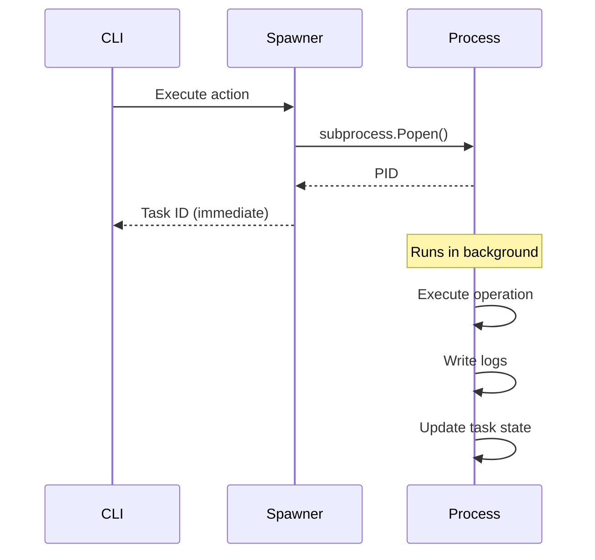

# ADR-003: Background Task Execution

**Status**: Accepted

**Context**: Long API operations (30-60s) block AI agents and appear as failures

**Decision**: Spawn background processes for operations >5 seconds

**Rationale**:

- AI agents can continue with other work
- Clear separation of concerns
- Status monitoring via task commands
- Logs captured to files

**Consequences**:

- ✅ Non-blocking AI workflow
- ✅ Isolated process failures
- ✅ Better error logging
- ⚠️ More complex debugging
- ⚠️ Task monitoring required

**Implementation**:

